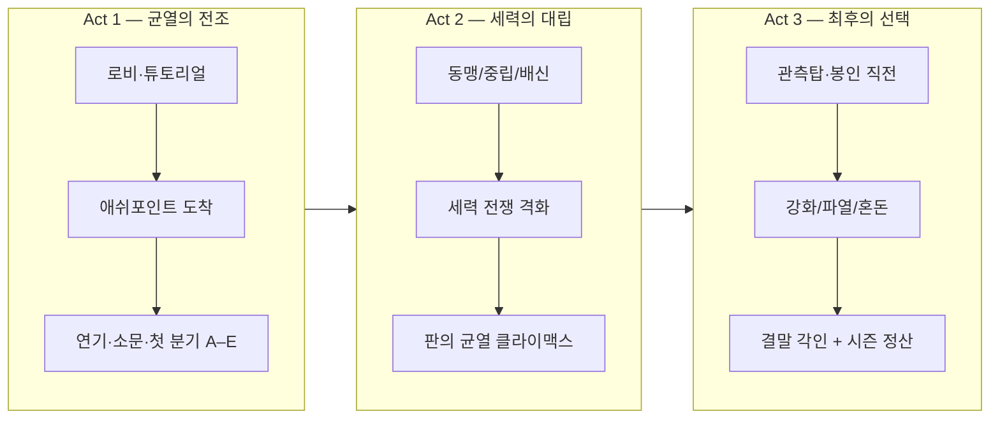

# 00 — 비전: 이세계 풀다이브 VR

## 한 줄 정의

**「에르도리아」는 VR과 BCI가 융합되고 Mnemosyne Core(딥마인드급 월드 모델)가 샤드를 지배하는 초몰입 풀다이브 이세계이며, 오감·육감이 현실과 동형인 수준에서 플레이어는 전송된 이방인으로 봉인·세력·결말을 직접 쓴다.**

상세 스택: [09_BCI_DEEPMIND_FUSION.md](09_BCI_DEEPMIND_FUSION.md) · 동형 규격: [10_REALITY_PARITY.md](10_REALITY_PARITY.md)

## 핵심 기둥 (Design Pillars)

| 기둥 | 의미 | 플레이어가 느끼는 것 |
|------|------|----------------------|
| **Full Presence** | 오감+육감(BCI)·체화·피로·공포까지 동형 | “진짜 이 몸으로 서 있다” |
| **Mnemosyne Living World** | 딥마인드급 월드 모델이 샤드를 숨 쉬게 함 | “내가 없어도 살아 있다” |
| **Reality Parity R3** | 현실과 구분 가능한 유일한 단서는 귀환 앵커뿐 | “게임인지 잊었다” |
| **Isekai Contract** | 현실 자아와 게임 자아가 분리·연결 | “나는 돌아갈 수 있지만, 여기서의 선택도 진짜다” |
| **Living Faction Board** | 세력이 플레이어 없이도 움직임 | “내가 안 가도 전쟁은 진행된다” |
| **Seal as World Clock** | 봉인 약화 = 서버 전체 긴장도 | “시즌이 끝나가고 있다” |
| **Choice Fossils** | 분기·평판·플래그가 결말에 화석처럼 남음 | “그때 중립 택한 게 지금 복선이다” |

## 타깃 경험 곡선

## 세계관 레이어 (3층)

1. **현실층 (Meta)** — 접속기, 운영사, 패치, 금지 행위, 로그아웃.
2. **전송층 (Isekai)** — 영혼/데이터 이전, 부활 규칙, 「신」 NPC.
3. **에르도리아층 (Diegetic)** — 봉인, 실버우드, 변경, 관측탑 — 플레이어는 이 층의 언어만 쓰는 것이 기본.

서사는 **3층이 동시에 작동**할 때 가장 강하다.  
예: 장로가 봉인을 말할 때(3층) + 시스템이 「세션 안정도」를 떨어뜨릴 때(1층) + 플레이어가 「전생 기억」 플래그를 가질 때(2층).

## 성공 지표 (설계용)

- **몰입:** 턴당 평균 서사 행동 수, `talk`/`investigate` 비율.
- **분기 인지:** Phase 1 선택 후 10턴 내 세력 접촉 2회 이상.
- **결말 다양성:** 5×3×3 경로 조합 중 서로 다른 `resolved_ending` 비율.
- **재접속:** 시즌 간 `flags.vr_meta.legacy_import`로 일부 평판·칭호 이전.

## 금지 (톤 가이드)

- 현실 정치·실존 종교 직접 풍자.
- 풀다이브 사망 = 현실 사망 (반드시 **게임 내 규칙**과 **현실 안전** 분리 명시).
- “모든 NPC가 플레이어를 우주의 중심” — 세력 AI는 플레이어 무관 시나리오도 돌아가야 함.
