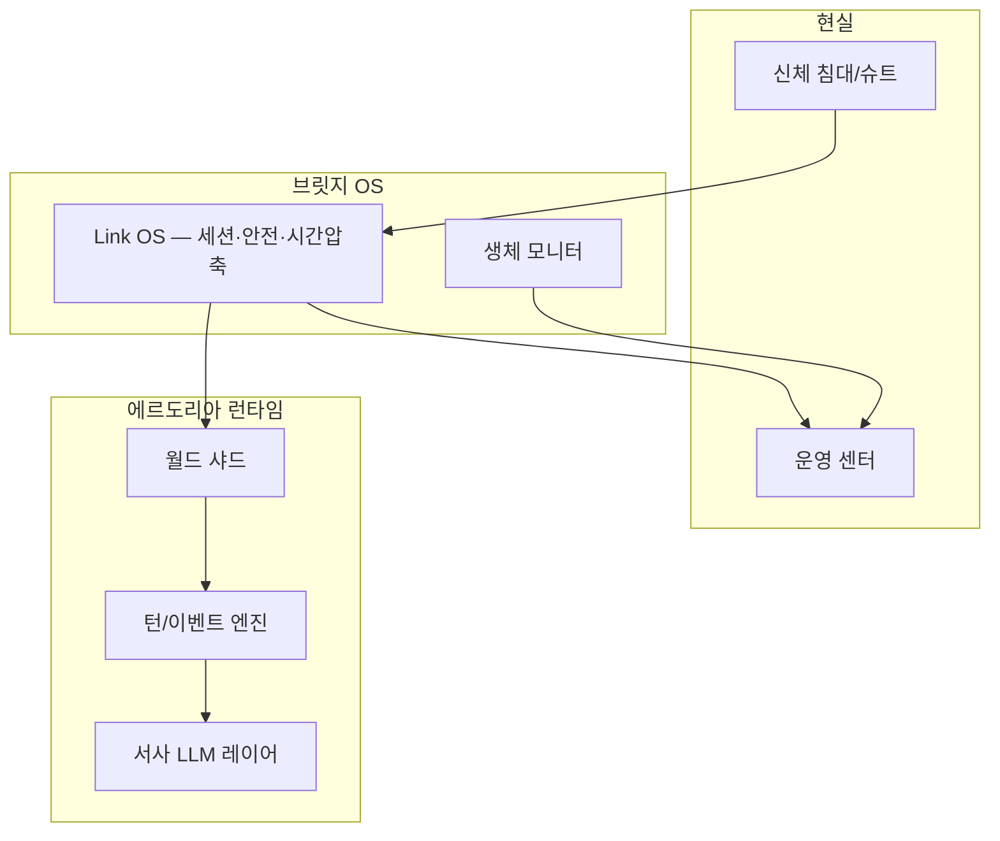

# 01 — 풀다이브 플랫폼 레이어

## 제품명 (가칭)

**Eldoria Link Nex** — VR×BCI 융합 정식명. 레거시: Eldoria Full-Dive.  
내부 코드명 `fantasy_simulator`, 세계명 **에르도리아**.

> **Nex 스택 전체:** [09_BCI_DEEPMIND_FUSION.md](09_BCI_DEEPMIND_FUSION.md)

## 접속 스택 (레거시 VR — Nex 이전)



## 감각 매핑 (설계)

| 감각 | 게임 내 표현 | 엔진 훅 (제안) |
|------|----------------|----------------|
| 시각 | 날씨·시간·UI 없는 1인칭 | `world.time_of_day`, `world.weather` |
| 청각 | 우물 속삭임·광장 노래 | `flags.pending_events` + horror seeds |
| 촉각 | 전투 피격·추위 | `combat` 샤드, `world.season` |
| 후각/미각 | 여관 음식·대장간 | `rest` 액션 → HP + 짧은 버프 플래그 |
| 고통 상한 | 「고통 리미터」 | `flags.vr_meta.pain_cap` (0.0–1.0) |

## 세션 규칙

| 항목 | 규칙 |
|------|------|
| **로그인** | 로비 → 캐릭터 슬롯 → 전송 의식(컷신) → `scene: ashpoint_arrival` |
| **로그아웃** | 안전 구역·여관·로비만 즉시. 전투/던전 중 = 지연 로그아웃(10초 채널링) |
| **강제 해제** | 생체 이상·운영자 킥 → `flags.vr_meta.forced_disconnect` |
| **시간 압축** | 1 턴 ≈ 15–30분 게임 내 시간 (낮/밤 사이클은 `execute_turn`에서 진행) |
| **동시 접속** | 변경 1샤드 ≈ 수백 명; 인스턴스 던전은 파티별 |

## 안전·윤리 (필수 서사)

- **Pain Cap:** 기본 70%. PvP 구역에서만 상향 가능(동의).
- **Trauma Filter:** `horror_extreme` 씨앗은 성인 인증 + 필터 ON 시만 가중치 적용.
- **Minor NPC:** 리사 등 미성년 역할 NPC — 호러·성적 콘텐츠 라우팅 제외.
- **현실 알림:** 2시간마다 「수분 섭취」 시스템 메시지 (메타, 4차 벽 최소).

## 운영자·패치 (다이전)

| 역할 | 세계 내 이름 | 기능 |
|------|----------------|------|
| GM | 「은빛 관리자」 | 이벤트 수동 트리거, 버그 복구 |
| 패치 | 「시간의 균열」 | 신규 지역·시즌 오픈 설명 |
| 밴 | 「영혼 추방」 | `flags.vr_meta.banned` |

## `flags.vr_meta` 제안 스키마

```json
{
  "vr_meta": {
    "player_id": "uuid",
    "display_name": "방랑자_042",
    "pain_cap": 0.7,
    "session_start_utc": "2026-06-04T12:00:00Z",
    "total_playtime_hours": 12.5,
    "forced_disconnect": false,
    "legacy_season": null,
    "subscription_tier": "standard"
  }
}
```

엔진은 당장 이 필드를 **무시해도** 플레이 가능. 서사·UI·로비 구현 시 점진 도입.

## Link OS 로비 (콘텐츠)

- **전송 대기실:** 다른 플레이어 실루엣(비전투).
- **기억 서고:** 지난 시즌 결말 열람 (`main_story.resolved_ending`).
- **계약서 UI:** 이세계 전송 동의 — `02_ISEKAI_FRAME.md` 참고.
