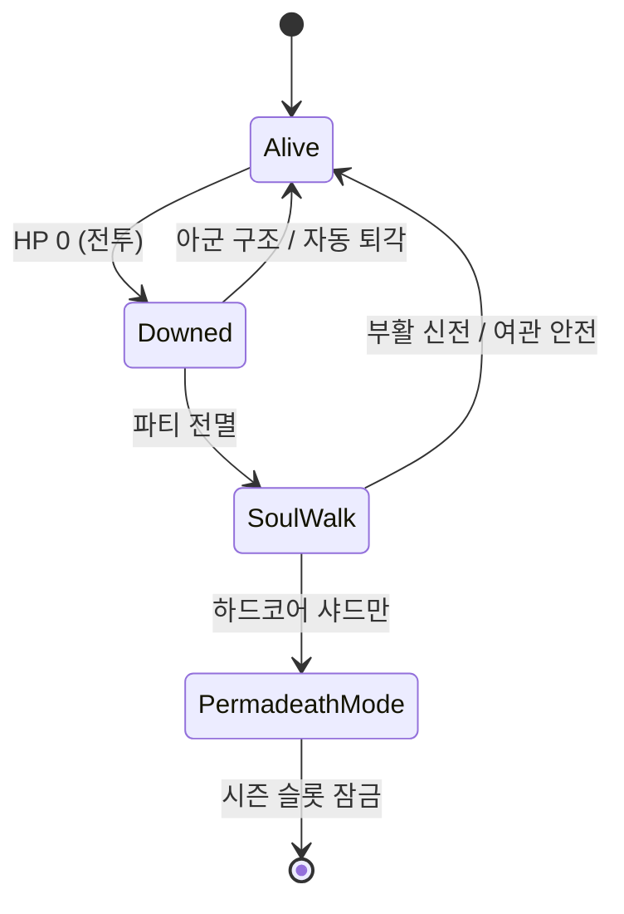

# 02 — 이세계 프레임 (전송·신·사망)

## 전송의 종류

| 유형 | 설정 | 서사 훅 |
|------|------|---------|
| **표준 전송** | 운영사 계약, 자발적 | 튜토리얼 NPC 「안내자」 |
| **강제 전송** | 베타 버그·실험 | `player_past` 씨앗과 연동 |
| **환생형** | 캐릭터 슬롯 삭제 후 재시작 | `legacy_season` 일부 칭호만 이전 |
| **NPC 각성** | 희귀 — AI가 자각 | 장기 로드맵, `grey_cloak` 비밀과 연결 가능 |

## 플레이어 정체성

- **현실 이름:** 저장하지 않음 (개인정보).
- **게임 이름:** `vr_meta.display_name` — 변경 1회/시즌.
- **이세계 칭호:** `flags.titles[]` — 세력·퀘스트로 부여.
- **전생 기억 플래그:** `flags.isekai_memory_glimpses` — 특정 씨앗·대사 해금.

### A–E 1단계 분기 = 이세계 「성향 각인」

| 선택 ID | 세계 내 해석 | VR 메타 해석 |
|---------|----------------|----------------|
| `ally_village` | 마을·공동체 | 소셜·안정 플레이어 |
| `seek_truth` | 진실·기록 | 로어 헌터 |
| `pursue_power` | 힘·서약 | 빌드·리스크 선호 |
| `exploit_chaos` | 기회·이득 | 경제·투기 |
| `stay_neutral` | 중립·관망 | 솔로·자유도 |

2단계 동맹 5세력은 **1단계 각인의 「구체화」** — `phase2_alliance_routes` / `phase3_alliance_routes`.

## 신(God) 레이어 — 세계 내 설명

에르도리아 주민은 「신」을 봉인 창조자·고대 존재로 믿는다.  
플레이어(메타 인지)는 「관리자·패치 신」을 의심할 수 있다.

**준신(엑스칼리버 홀더)** 의 4년 소원은 세계를 흔들 수 있으나, **종족 멸절·신화 대량 증식·영원 불사·월드 재창조** 는 **신만** 할 수 있다 — [34_DEMIGOD_SOVEREIGN_EXCALIBUR.md](34_DEMIGOD_SOVEREIGN_EXCALIBUR.md).

| 신격 | 역할 | NPC/시스템 대응 |
|------|------|-----------------|
| **잿빛 인장** | 봉인의 주인(죽음?) | `ashen_seal_cracking` 메인 |
| **은빛 관리자** | 질서·규칙 | GM, `silver_cross_order` |
| **칠흑 속삭임** | 파괴·해방 | `black_covenant` |
| **기록자** | 진실·관측 | `ashen_wardens`, `grey_cloak` |

## 사망·부활

| 모드 | 규칙 | VR 연출 |
|------|------|---------|
| **일반** | 사망 시 골드·내구도 패널티, `tension` +3 | 시야 붉어짐 → 로비 화이트아웃 |
| **하드코어** | `vr_meta.hardcore=true` — 슬롯 1회 사망 시 시즌 종료 | 「영혼 붕괴」 컷신 |
| **봉인 파열 이벤트** | 월드 보스 실패 시 샤드 전체 디버프 | 서버 공지 |

**절대 금지:** 게임 사망 = 현실 사망 서사. 항상 Link OS 개입 한 줄 삽입.

## 로그아웃 = 「귀환」

- 안전 구역: 즉시. `scene: link_lobby`.
- 위험 구역: 채널링 중 공격 시 중단 + `tension` 상승.
- 스토리 클라이맥스 중: `phase3_climax_done` 전 로그아웃 허용(현실 우선)하되, 재접속 시 「봉인이 기다린다」 훅.

## 이세계 전용 시스템 (설계)

| 시스템 | 설명 | 엔진 연결 |
|--------|------|-----------|
| **언어 동화** | 모든 NPC 한국어 — 메타: 자동 번역 | LLM 프롬프트 |
| **스탯 윈도우** | 메타 UI — `status` 명령 | `state_report` |
| **스킬 각인** | 레벨 없음, **각인·평판·플래그** 성장 | `main_story`, `faction_reputation` |
| **귀환자 시장** | 현실 화폐 ❌, 게임 골드·교환 | `inventory.party_gold` |

## 플레이어 유형 (페르소나)

1. **순수 이세계 몰입형** — 메타 언급 싫어함 → 3층 서사만.
2. **메타 해커형** — 패치·버그·관리자 추적 → `conspiracy` 씨앗.
3. **소셜 길드형** — 2단계 동맹 고정 → 파티 버프 (미구현, 로드맵).
4. **로어 아카이브형** — `seek_truth` + 관측탑 100% — `lore/` 해금.

각 유형이 **동일한 3단계 메인**을 다른 이유로 플레이하도록 분기 대사·`by_alliance_faction` 확장.
