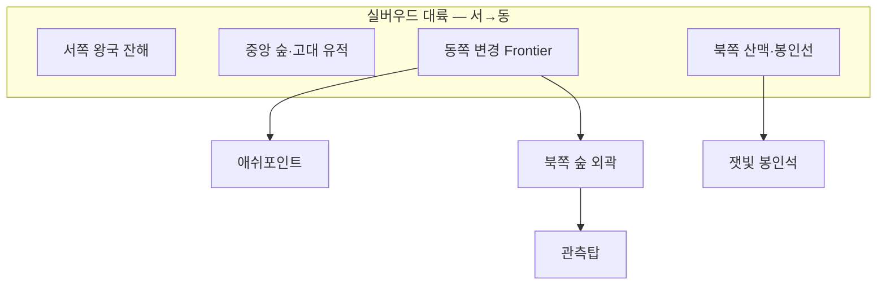

# 03 — 세계 지도 (에르도리아)

## 대륙 개요

**에르도리아 전체**는 약 `100_000 × 100_000` 월드 좌표로 설계한다 (상세·10대륙 표: [23_WORLD_SCALE_AND_TEN_CONTINENTS.md](23_WORLD_SCALE_AND_TEN_CONTINENTS.md), 데이터: `config/world_atlas.json`).

**실버우드(Silverwood)** — 10대륙 중 1번. 고대 숲과 봉인이 겹친 대륙.  
현재 플레이 가능 영역은 **변경(Frontier)** — 실버우드 동쪽 가장자리. **첫 왕국**은 이 구역에서 건설·확장한다.

## 존 (엔진 `location_zones`)

| zone ID | 대표 위치 문자열 | 위험도 | 오픈 상태 |
|---------|------------------|--------|-----------|
| `ashpoint` | 애쉬포인트, 광장, 여관 | 낮음 | ✅ |
| `forest` | 북쪽 숲, 숲 외곽 | 중간 | ✅ |
| `tower` | 관측탑, 룬 센티넬 | 높음 | ✅ 퀘스트 3 |
| `mountain` | 북쪽 산길 | 중간 | ✅ Phase 1 |
| `dungeon` | (예정) 지하 회랑 | 높음 | 🔜 |
| `capital` | (예정) 실버헤이븐 | 낮음 | 🔜 시즌 2 |

`event_engine.FRONTIER_ZONES` = `ashpoint`, `forest`, `tower` — 확장 시 manifest에 추가.

## 애쉬포인트 (Ashpoint) — 허브

| 장소 | NPC | 게임 루프 |
|------|-----|-----------|
| 광장 | 리사, 민병대 | 소문·정치 이벤트 |
| 여관 | 릴리안 | 휴식·정보·`talk` |
| 대장간 | 토렌 | 장비·사이드 퀘스트 |
| 회관 | 장로 마렌 | 메인·자치회 |
| 우물 | — | 호러·칠흑 제안 (`night`) |
| 북문 | 회색 망토 | 감시자 라인 |

상세: `lore/locations/ashpoint.md`

## 북쪽 숲 — 던전화

- **1단계:** 연기 목격, 외곽 조사.
- **2단계:** 세력 충돌·매복 (`phase2_faction_raid` 등).
- **3단계:** 봉인 직전 압박, `story_seal_near_break`.

## 관측탑 — 클라이맥스 아레나

- 룬 센티넬, 실버 스토커, 봉인 파편.
- Phase 3 클라이맥스 기본 위치: `관측탑`.

## 확장 지역 (로드맵)

| 지역 | 테마 | 메인 스토리 연결 |
|------|------|------------------|
| **실버헤이븐** | 수도·왕정 잔해 | `silver_cross_order` 본거 |
| **블랙팽 협곡** | 산적·약탈 | `blackfang_marauders` |
| **잿빛 해안** | 난파선·외신 흔적 | 봉인 기원 로어 |
| **기록의 탑군** | 감시자 아카이브 | `seek_truth` 전용 인스턴스 |
| **칠흑 성채** | 서약 던전 | `pursue_power` / `final_break` |

## 날씨·시간·계절

| 키 | 값 예 | 이벤트 영향 |
|----|-------|-------------|
| `world.time_of_day` | morning…night | `requires_time` |
| `world.season` | 봄·여름·가을·겨울 | 패시브 `tension` drift |
| `world.weather` | clear, rain, ashen_fog | 연기 이벤트 가중 |

**잿빛 안개 (`ashen_fog`):** `tension >= 50` 시 랜덤 전환 — 봉인 약화 연출.

## 이동·여행 (설계)

| 방식 | 턴 비용 | 구현 |
|------|---------|------|
| 도보 | 1 | `explore` |
| 마차 | 0 (골드) | merchant 이벤트 |
| 텔레포트 룬 | 0 (쿨다운) | `flags.tower_rune_unlocked` |
| 풀다이브 「빠른 이동」 | 메타 UI | 미구현 |

## 월드 보스·샤드 이벤트

- **봉인 균열 게이지:** 샤드 전체 `world.tension` — 플레이어 기여 누적.
- **50+:** `phase2` 격화 씨앗 가중.
- **70+:** `horror_extreme` 해금.
- **90+:** Phase 3 강제 훅 (운영 이벤트).
