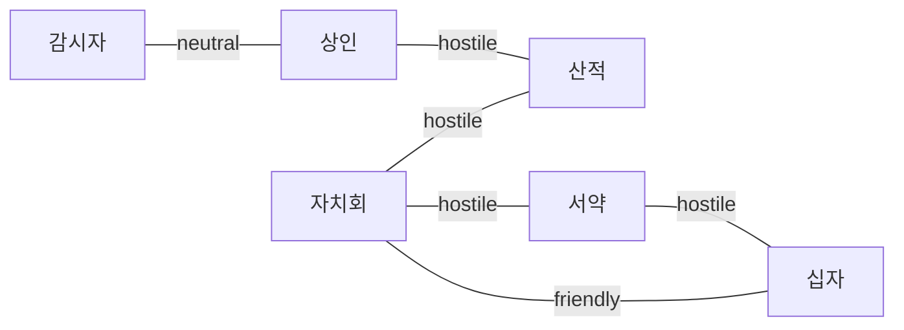

# 04 — 세력·정치

## 핵심 6세력 (+ 플레이어)

`config/factions.json` 기준. VR 세계에서는 **「깃발 Guild」** 로 UI 표시.

| ID | 한글명 | VR 플레이어 판타지 |
|----|--------|---------------------|
| `ashpoint_council` | 애쉬포인트 자치회 | 로컬 허브·민병·생존 |
| `silverwood_trade_union` | 실버우드 상인 연합 | 경제 PvE·투기 |
| `blackfang_marauders` | 블랙팽 약탈단 | 카오스·약탈 이벤트 |
| `ashen_wardens` | 잿빛 감시자 | 로어·진실·기록 |
| `black_covenant` | 칠흑의 서약 | 파워 빌드·봉인 해제 |
| `silver_cross_order` | 은빛 십자 기사단 | 질서·관리자 신앙 |

## 관계 매트릭스 (요약)



플레이어 평판 변동 시 `relationship_stances` — 한 세력 이득이 적대 세력에 `penalty`.

## 2단계 정치 선택

| path | 세계 의미 | 세력 태도 |
|------|-----------|-----------|
| `path_alliance` | 한 깃발 아래 | 1세력 동맹 + 나머지 재조정 |
| `path_neutral` | 균형·이득 | 모두가 거리 두며 거래 |
| `path_betrayal` | 약속 파기 | 전원 적대 가중 |

동맹 시 **1단계 A–E** 가 어느 깃발인지 결정 — `phase2_alliance_routes`.

## 3단계 최종 정치

| final | 봉인 | 대표 결말 키 |
|-------|------|----------------|
| `final_reinforce` | 강화 | `seal_maintained` |
| `final_break` | 해제 | `ancient_awakening` |
| `final_chaos` | 방치·혼돈 | `age_of_chaos` |

동맹 루트별 권장 매핑: `phase3_alliance_routes` (설계·테스트와 동일).

## 평판 루프

```
행동 → outcome.faction_reputation → tier 변경 → milestone 이벤트
     → zone_blocked / price_modifier / quest_unlock
```

| tier | 수치 | VR 연출 |
|------|------|---------|
| hostile | ≤ -40 | 습격·금지 구역 |
| unfriendly | -39 ~ -10 | 가격 상승 |
| neutral | -9 ~ 9 | 기본 |
| friendly | 10 ~ 39 | 퀘스트·할인 |
| allied | ≥ 40 | 민병 지원·동행 |

## AI 세력 자율 행동 (설계)

턴 종료 시 (`tick_world_systems` 확장):

1. `tension` tier별 **세력 스케줄** 롤.
2. 플레이어 무관 **NPC vs NPC** 이벤트 로그 (`world.rumors` 한 줄).
3. 동맹 path 고정 시 적대 세력 `raid` 가중.

구현 우선순위: rumors 자동 생성 → milestone 자동 큐.

## 정치 미니게임 (로드맵)

| 이름 | 설명 |
|------|------|
| **회관 투표** | 자치회 결정 — 플레이어 설득 체크 |
| **상인 입찰** | 희귀품·보급로 |
| **기사 시험** | 십자 기사단 입문 |

엔진: `flags.politics.{event_id}` + 전용 seeds shard.

## 플레이어가 「왕」이 되지 않는 이유

풀다이브 MMO에서 **단일 총괄 왕** 은 샤드 붕괴.  
대신 **「변경의 조정자」** 칭호 — 여러 세력 평판 40+ 동시 달성 시 `ending_bias.new_order` 가중.
