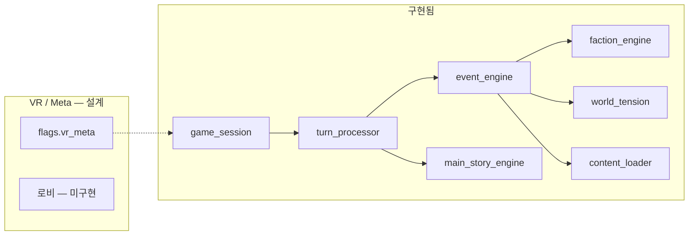

# 06 — 시스템 ↔ 엔진 매핑

풀다이브 이세계 설계를 **현재 코드**에 올리는 방법.

## 모듈 맵

## 상태 샤드

| 샤드 | VR 용도 | 키 예 |
|------|---------|-------|
| `world` | 환경·샤드 긴장 | `tension`, `location`, `rumors` |
| `flags` | 퀘스트·이벤트·스토리 | `main_story`, `pending_events`, `alliance_faction` |
| `flags.faction_reputation` | 깃발 UI | 6세력 ID |
| `inventory` | 경제 | `party_gold` |
| `combat` | 전투 인스턴스 | HP, 적 ID |
| `event_log` | 「시스템 로그」 연출 | 턴 요약 |

제안: `flags.vr_meta` — `01_FULLDIVE_PLATFORM.md` 스키마.

## 메인 스토리 엔진

| 설계 개념 | 코드 |
|-----------|------|
| 시즌 1 3막 | `phases[]`, `phase1/2/3_flow` |
| 이세계 각인 A–E | `choices_made` + `story_choice_*` |
| 동맹 5세력 | `phase2_alliance_routes`, `story_alliance_*` |
| 최후 선택 3종 | `phase3_choices`, `final_*` |
| 클라이맥스 필터 | `_applicable_climax_seeds()` |
| 결말 | `_try_resolve_ending()`, `resolved_ending` |

## 이벤트 씨앗

| seed_type | VR 연출 |
|-----------|---------|
| `main_story` | 컷신급, 진행도 |
| `horror_event` | 고통 캡·필터 |
| `conspiracy` | 메타 힌트 |
| `random_event` | 월드 살아있음 |
| `political` | 세력 루머 |

게이트: `requires_tension_*`, `requires_faction_*`, `requires_main_story_*`, `location_zones`.

## LLM 파이프라인

| 플레이어 행동 | 모델 | 프롬프트 |
|---------------|------|----------|
| explore, talk | Claude | `narrator_claude.md` + lore snapshot |
| combat, cast | Codex | `mechanics_codex.md` |
| (검증) | Arbiter | `world_arbiter.md` |

**VR 서사:** 프롬프트에 「풀다이브 감각」「고통 캡」 한 줄 추가 가능 (`prompts/narrator_claude.md` 확장).

## 신규 구현 체크리스트 (우선순위)

| P | 기능 | 터치 파일 |
|---|------|-----------|
| P0 | `vr_meta` 읽기·저장 | `state_manager`, `world_state.json` 예시 |
| P1 | 로비 `scene: link_lobby` | seeds `meta_lobby.json` |
| P1 | 강제 로그아웃 플래그 | `turn_processor` |
| P2 | 샤드 루머 자동 생성 | `world_systems.py` |
| P2 | 시즌2 분기 월드 | `main_stories.json` story #2 |
| P3 | 파티 인스턴스 | 새 샤드 `party` |
| P3 | PvP 존 | `location_zones` + rule |

## 테스트 매핑

| 설계 보장 | 테스트 |
|-----------|--------|
| 15 path2 cross | `test_phase2_cross_routes` |
| 15 path3 ending | `test_phase3_cross_routes` |
| 동맹 5 | `test_phase*_alliance_by_phase1` |
| 플로우 불변 | `test_phase*_playtest` |
| 씨앗 무결성 | `test_main_story_seed_catalog` |

## 설정 파일

| 파일 | 역할 |
|------|------|
| `config/factions.json` | 세력 |
| `config/llm_routing.json` | 모델·폴백 |
| `events/main_stories.json` | 시즌·phase flow |
| `events/dialogues.json` | NPC + `by_alliance_faction` |
| `config/vr_meta.schema.json` | (신규) 메타 필드 문서 |
