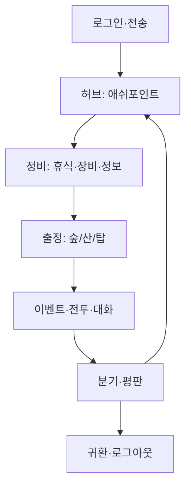

# 08 — 플레이어 루프

## 마이크로 루프

**Classic (현재 코드):** 1 `run_turn` = Simulation Beat — [11_TEMPORAL_MODEL.md](11_TEMPORAL_MODEL.md) 참고.

```
입력(action) → 시간 진행 → 이벤트 롤 → 평판/긴장/스토리
            → LLM 또는 rule 서술 → state 저장
```

**Nex Live (목표):** Presence Stream(연속) 위에 Action Moment(의도 확정 시만 위 파이프라인).

**VR 감각:** Stream — 초당 체감 힌트; Moment — 선택의 여파 (`tension_delta`, rumor).

## 코어 루프 (1세션, 30–90분)



## 일일 루프 (데일리)

| 활동 | 보상 | 쿨다운 |
|------|------|--------|
| 여관 휴식 | HP, `time` skip | — |
| 장로/릴리안 일일 대화 | rumor 1 | 1 day |
| 세력 일일 계약 | rep +3 | 1 day |
| 봉인 기도 (십자) | tension -2 | 1 day |

구현: `flags.daily.{npc_id}` 날짜 스탬프.

## 주간 루프

- **샤드 이벤트:** `world.tension` 기반 월드 보스.
- **에피소드 씨앗:** 운영이 `pending_events` 주입.
- **회관 투표:** (로드맵) 플레이어 표 1장.

## 중기 루프 (시즌 1)

| 주차 상당 | 목표 |
|-----------|------|
| 1 | Phase 1 완료, A–E 각인 |
| 2 | Phase 2, path 선택 |
| 3 | Phase 3, 결말 |

`main_story.progress` 가 가이드 — 강제는 아님.

## 장기 루프 (시즌·NG+)

- 결말 4+ 종 수집
- `alliance_faction` 5종 플레이
- 하드코어 슬롯
- 시즌 2 import

## 동기 부여 매트릭스

| 유형 | 시스템 |
|------|--------|
| 탐험 | 새 zone, lore 해금 |
| 성장 | 평판 tier, 각인 |
| 사회 | 동맹 NPC, `talk` |
| 경쟁 | (미래) PvP, 리더보드 |
| 수집 | 결말, 칭호, 금형 |
| 스토리 | 3단계 메인 |

## 이세계 VR 특화 루프

### 「전송자」 정체성

- 다른 플레이어를 「귀환자」로 인식 — `vr_meta.display_name` 표시.
- 1단계 A–E는 **영혼 색** (UI 테마) 로 연출 가능.

### 몰입 유지

- **침묵 페널티 없음** — `rest` 로 관망 가능.
- **공포 회복:** 여관 = 안전존 (`horror` 가중 0).

### 이탈 방지

- 클라이맥스 직전 재접속 훅 (`phase3_climax_ready` 유지).
- 미완 퀘스트 요약 in `status`.

## 실패·좌절 완화

| 실패 | 복구 |
|------|------|
| 전투 패배 | 골드 손실, 여관 부활 |
| 평판 hostile | 속취 퀘스트 1종 per faction |
| 스토리 막힘 | `investigate` + elder 힌트 (`_phase*_next_hint`) |
| LLM 오류 | rule fallback |

## 엔드게임 (결말 후)

- Link OS 기억 서고
- NG+ 캐릭터 (50% rep)
- 시즌 2 프리뷰 컷신
- (선택) 하드코어 「벽화」 이름

## Composer / Cursor 플레이 루프

개발·디버그용:

```bash
python3 simulation_engine.py -i --mode rule --seed 42
# @world_state.json @docs/design/README.md
```

`--batch` 로 15/45 경로 회귀 테스트.
