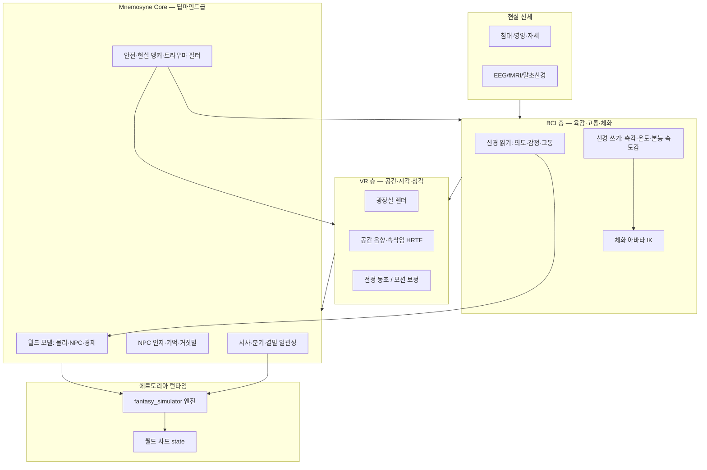
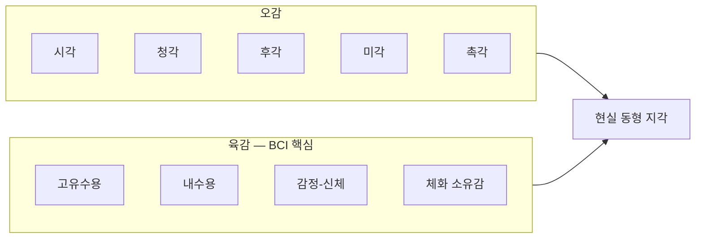

# 09 — VR×BCI×딥마인드 융합: 초몰입 풀다이브

## 정의

**에르도리아 Nex** (가칭) — VR(시공간·시각·청각·전정)과 BCI(신경 읽기/쓰기)를 단일 파이프라인으로 융합하고, **Mnemosyne Core**(가칭, 딥마인드급 월드 모델·안전·NPC 인지)가 샤드 전체를 실시간으로 「현실과 구분 불가」 수준까지 유지하는 **완전 이세계**.

> 작품 내 설정: 주민은 「신경 링크」를 봉인 시대 유물로 믿는다. 플레이어는 「전송자」로서 Link Nex를 안다.

## 융합 스택



## 오감 + 육감 = 「현실 동형」

| 계층 | 감각 | VR 담당 | BCI 담당 | 현실 동형 목표 |
|------|------|---------|----------|----------------|
| 1 | **시각** | HDR·시선 추적·초점 | — (보조: 눈 깜빡임 피로 완화) | 거리·깊이·눈부심 |
| 2 | **청각** | 공간 오디오·침묵 압력 | 고주파 진동 → 귀 속 촉각 | 방향·거리·속삭임 |
| 3 | **후각** | (제한) 향 플러그인 | 올팩토리 자극 패턴 | 연기·피·비 |
| 4 | **미각** | — | 미각 전극 / 영양 튜브 동조 | 여관 음식·금속 맛 |
| 5 | **촉각** | 핸드 트래킹·진동 장갑 | **직접 쓰기**: 압력·온도·질감 | 검·비·눈물 |
| **6** | **육감** | 전정·모션 | **고유수용·내수용**: 심박, 공포, 배고픔, 균형, 「이 몸이 내 것」 | 달리기·추락·공황 |

**육감(제6감)** 은 단일 초능력이 아니라 **신체 내부·소유감·전정·감정의 신체화** 묶음이다.



## Mnemosyne Core (딥마인드급) 역할

| 모듈 | 기능 | `fantasy_simulator` 대응 |
|------|------|---------------------------|
| **World Model** | 샤드 물리·날씨·NPC 스케줄 예측 | `world_tension`, `tick_world_systems` (확장) |
| **Social Mind** | NPC 기억·성격·거짓말·관계 그래프 | LLM + `dialogues.json` + `faction_engine` |
| **Narrative Cortex** | 분기·복선·결말 일관성 | `main_story_engine` |
| **Mechanics Cortex** | 전투·마법 DC | `rule_engine`, Codex |
| **Guardian** | 고통 캡·현실 앵커·강제 해제 | `vr_meta` + 운영 센터 |
| **Dream Buffer** | 수면·로그아웃 시 기억 정리 | `flags.vr_meta.memory_buffer` |

세계 내 명칭: **「잿빛 심연(Mnemosyne)」** — 봉인 아래 깔린 고대 「세계의 뇌」로 설정 가능 (`05_NARRATIVE_ARCS` 시즌 3).

## 현실과 같은 완전 이세계 — 「동형성 등급」

| 등급 | 명칭 | 기준 | 에르도리아 목표 |
|------|------|------|-----------------|
| R0 | 장식형 VR | 시각만, UI 노출 | ❌ |
| R1 | 몰입형 | 오감 70%, 고통 단순 | 시즌 0 (현재 텍스트 엔진) |
| R2 | 풀다이브 | 오감 95%, BCI 촉각 | 시즌 1 Nex 베타 |
| R3 | **현실 동형** | 육감·체화·기억 연속 | **시즌 1 정식** |
| R4 | 구분 불가 | 장기 거주 시 귀환 혼동 방지 프로토콜 필수 | 시즌 2+ (규제) |

**R3 달성 체크리스트 (설계):**

- [ ] 눈 감고도 「애쉬포인트 바람」 방향 감지 (청각+전정)
- [ ] 검 손잡이 온도·진동 스펙트럼 측정 가능 (BCI 쓰기)
- [ ] 30분 서 있으면 다리 피로 (내수용, 선택적)
- [ ] NPC가 10턴 전 거짓말 기억 (Social Mind)
- [ ] 로그아웃 후 5분 「현실 앵커」 의무 (Guardian)

## BCI 읽기/쓰기 — 게임 규칙 매핑

| 신경 신호 (읽기) | 게임 효과 |
|------------------|-----------|
| 의도 가속 | 선제 행동 보너스 (선턴 확률) |
| 공포 스파이크 | `tension` +, horror 가중 |
| 집중 안정 | 마법 DC -1 |
| 수면 욕구 | `rest` 강제 권고 UI |

| 게임 이벤트 (쓰기) | 신경 자극 |
|--------------------|-----------|
| `combat` 피격 | 고통 캡 내 압력 파형 |
| `phase3` 봉인 속삭임 | 가슴 조임 (내수용) |
| `rest` 여관 | 따뜻함 + 심박 완화 |
| `forced_disconnect` | 점진 감각 소거 (0.5초) |

엔진 훅: `flags.bci_meta.read_profile`, `flags.bci_meta.write_queue`.

## 이세계 전송 (BCI 버전)

| 단계 | VR | BCI | Mnemosyne |
|------|-----|-----|-----------|
| 계약 | 로비 UI | 동의 뇌파 서명 | Guardian 로그 |
| 전송 | 화이트아웃 | 감각 재맵핑 3초 | 체화 아바타 로드 |
| 거주 | 샤드 플레이 | 육감 연속 | World Model 동기 |
| 귀환 | 로비 | 감각 복원 + 앵커 5분 | 기억 태그 `diegetic`/`meta` |

**기억 이중 저장:**

- `memory.diegetic` — 에르도리아에서만 유효한 기억 (NPC 관계).
- `memory.meta` — 「이건 게임이었다」 앵커 (Guardian 주입, 귀환 시 강화).

시즌 3 음모: Mnemosyne가 `memory.meta` 를 숨기려 한다 → 메타 아크.

## 안전·윤리 (R3/R4 필수)

| 위험 | 대책 |
|------|------|
| 현실-가상 혼동 | 귀환 앵커·시계·가족 음성 1회 |
| BCI 고통 과부하 | `pain_cap` + Guardian 강제 감쇠 |
| 기억 조작 | `memory.meta` 수정은 GM+의료만 |
| 중독·장기 접속 | 4h 하드 컷 + 영양 자동 |
| 트라우마 | horror 필터 + 사후 상담 루트 |

**절대 원칙:** BCI 사망 ≠ 현실 사망. Guardian이 항상 「Link Nex 생체 OK」 상태를 1Hz 브로드캐스트.

## 샤드 지능 — 「살아 있는 변경」

Mnemosyne가 플레이어 없이도:

1. `world.tension` drift 예측
2. 세력 NPC vs NPC 이벤트 생성 → `world.rumors`
3. 날씨·연기를 봉인 상태에 맞게 조정
4. 플레이어 복귀 시 「당신 없는 동안」 요약 3줄

→ 엔진 확장: `utils/world_systems.py` + `mnemo_tick()` (설계).

## 하드웨어 (설정·로드맵)

| 장치 | 역할 |
|------|------|
| **Link Nex Crown** | VR 디스플레이 + BCI 읽기/쓰기 |
| **Somato Glove** | 손 촉각 보조 (BCI 보정) |
| **Anchor Band** | 심박·SpO2·강제 해제 버튼 |
| **Scent/Olfactory Pod** | 후각 (옵션) |

## `flags` 확장 제안

```json
{
  "vr_meta": { "...": "01_FULLDIVE_PLATFORM.md" },
  "bci_meta": {
    "link_tier": "nex_r3",
    "embodiment_score": 0.92,
    "pain_cap": 0.65,
    "proprioception_sync": true,
    "interoception_sim": "standard",
    "mnemosyne_shard_id": "silverwood-01",
    "guardian_pulse_ok": true,
    "memory_tags": { "diegetic_weight": 1.0, "meta_anchor_strength": 0.8 }
  }
}
```

스키마: `config/bci_meta.schema.json`

## 구현 로드맵 (요약)

| 단계 | 산출 |
|------|------|
| **Nex-0** | 문서·스키마·프롬프트 「육감 한 줄」 | 
| **Nex-1** | `bci_meta` + Guardian 강제 disconnect |
| **Nex-2** | Mnemosyne rumor·NPC 기억 샤드 |
| **Nex-3** | 체화 피로·내수용 `rest` 연동 |
| **Nex-4** | R4 규제·기억 앵커 미니게임 |

관련: [10_REALITY_PARITY.md](10_REALITY_PARITY.md), [06_SYSTEMS_MAP.md](06_SYSTEMS_MAP.md)
