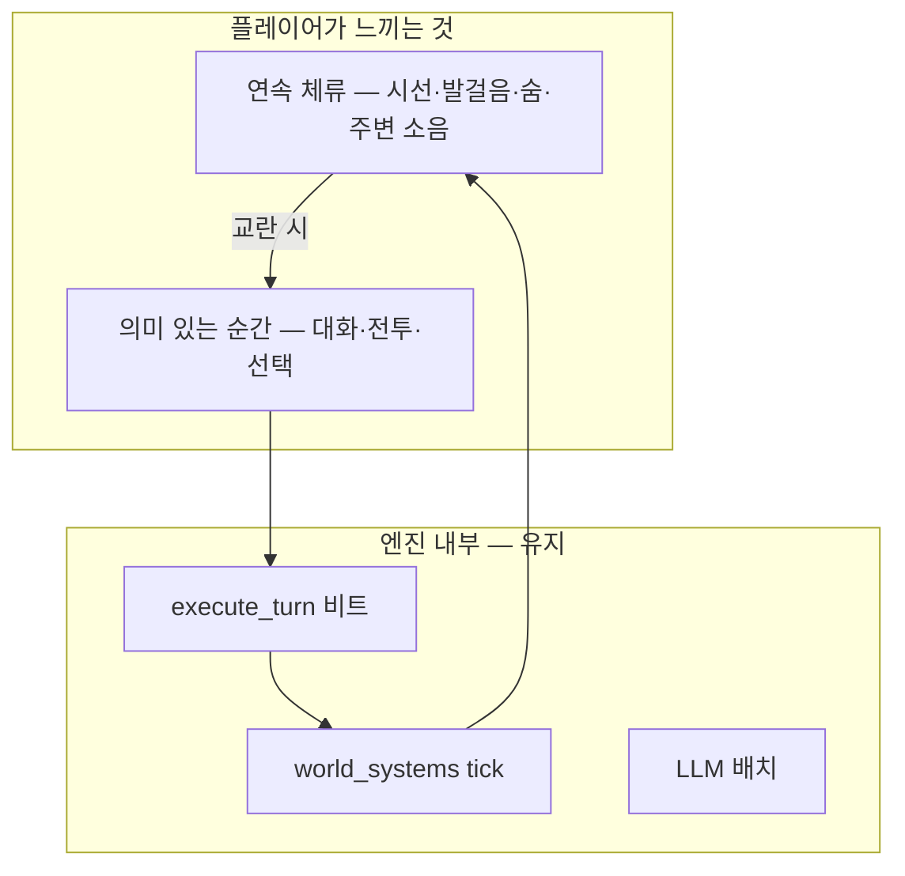

# 11 — 시간 모델: 턴 vs 초몰입 (Nex)

## 짧은 답

**완전 몰입형(R3) 플레이어 경험만 놓고 보면, 지금의 「한 줄 입력 → 턴 종료 → 시간 점프」는 맞지 않는다.**  
다만 **지금의 `run_turn` / `execute_turn` 구조는 버리지 않는다** — 그것을 **플레이어에게 안 보이는 「시뮬레이션 비트」** 로 내리고, 겉으로는 **연속 체류(presence stream)** 를 제공하는 것이 정답에 가깝다.



## 왜 턴이 몰입을 깨는가

| 턴 방식의 느낌 | BCI R3에서의 문제 |
|----------------|-------------------|
| 「explore」 한 번에 15–30분 게임 시간 점프 | 전정·내수용 불연속 — 「순간이동」 멀미 |
| 행동 후 텍스트 블록 대기 | 육감 파이프라인 끊김 |
| 세계가 플레이어 입력 때만 숨 쉼 | Mnemosyne 「살아 있는 샤드」와 모순 |
| 전투도 라운드 단위 | 긴장 곡선이 체스화 |

**텍스트 CLI / Cursor 개발·테스트** 에서는 턴이 **최고의 도구**다. **Link Nex 체험**과는 별 문제.

## 현재 코드에서 「턴」이 하는 일

`GameSession.run_turn()` → `execute_turn()`:

1. `advance_time()` — 낮/밤·일자 진행
2. `process_player_action()` — rule/LLM 해석
3. `tick_world_systems()` — 긴장도·메인 스토리

→ 이 3단계 묶음이 **「시뮬레이션 비트(Simulation Beat)」** 다. 이름만 `turn`일 뿐.

**유지할 가치:** 결정론 테스트(`test_phase*_clear_routes`), LLM 비용 통제, `world_state` 일관성, Composer 워크플로.

## 권장: 3층 시간 (Tri-Temporal Model)

### 1층 — Presence Stream (연속, 10–20 Hz)

플레이어·BCI·VR이 받는 **저강도 루프**. 게임 규칙은 거의 안 바뀜.

| 요소 | 주기 | 내용 |
|------|------|------|
| Somatic pulse | 1 Hz | 바람·심박·온도 한 줄 (`[체감]`) |
| Ambient audio | 연속 | 광장 소음·멀리 종소리 |
| Mnemosyne ambient | 5–30 s | NPC 움직임·rumor 갱신 없이 분위기만 |
| Attention | 이벤트 | 시선이 NPC에 가면 대사 힌트 |

**엔진:** 새 `presence_tick(dt)` — `main_story` progress는 **안 올림** (또는 극소량).

### 2층 — Action Moment (반실시간, 입력 기반)

플레이어 **의도**가 확정되는 순간. 여기서만 규칙·LLM·평판 변동.

| 입력 방식 | Nex |
|-----------|-----|
| 음성·제스처·시선+손 | BCI+VR |
| 텍스트 한 줄 | CLI·Cursor (개발) |
| 「멈춤」 제스처 | ATB/RTwP 일시정지 |

**엔진:** `resolve_moment(intent)` = 현재 `run_turn` 과 동일, 단 **시간 점프 폭을 intent에 비례**.

### 3층 — Story Beat (이산, 메인 스토리)

Phase gate·클라이맥스·결말 — **의도적으로 시네마틱**.

- `phase2_climax_done` 같은 플래그는 **Moment**로만 진입.
- 연속 스트림 중 **시간 왜곡·화이트아웃** 허용 (봉인·전송 연출).

## 플레이 모드 매트릭스

| 모드 | 1층 Stream | 2층 Moment | 용도 |
|------|------------|------------|------|
| **Nex Live** | ✅ | RTwP (전투 시 slow-mo 선택) | 정식 풀다이브 |
| **Nex Social** | ✅ | 대화만 Moment, 이동은 Stream | NPC 몰입 |
| **Classic Turn** | ❌ | 턴 = Moment | 테스트·배치·CI |
| **Composer Dev** | ❌ | `run_turn` | 지금 repo 기본 |

**결론:** 하나만 고르지 말고 **모드로 분기**.

## 전투 시간

| 스타일 | 몰입 | 엔진 변경 |
|--------|------|-----------|
| 턴제 (현재) | 낮음 | 유지 — Classic |
| **RTwP** | 높음 | `combat` 루프에 실시간 tick + pause-on-command |
| ATB | 중간 | 게이지 차면 Moment 1회 |
| 액션 | 최고 (BCI) | 대규모 — 시즌 2+ |

**권장:** overworld = Stream + Moment, combat = **RTwP** (일시정지 없이도 BCI 방어 제스처 가능).

## 시간 압축 재설계

지금: 1 `run_turn` ≈ 15–30분 게임 시간 (설계 문서).

Nex:

| 행동 유형 | 게임 시간 |
|-----------|-----------|
| 한 걸음·둘러보기 | 10–30초 (Stream 누적) |
| NPC 대화 한 화 | 2–8분 |
| 숲 외곽 이동 | 5–15분 |
| 휴식(여관) | 6–8시간 (의도적 점프, 수면 BCI) |
| 메인 클라이맥스 | 시네마 (압축 무제한) |

`advance_time()` 에 `delta: timedelta` 인자 — intent 분류기가 결정.

## Mnemosyne과 연속 시간

샤드는 플레이어 입력 없이도:

- `presence_tick`: 분위기·날씨·소리
- `sim_tick` (30–60s): rumor·세력 스케줄·tension drift
- `moment`: 플레이어 선택 반영

```text
매 실시간 초 ──► presence (가벼움)
매 30초     ──► sim_tick (중간)
플레이어 의도 ──► moment (= legacy run_turn)
```

## API 진화 (코드 로드맵)

| 단계 | API | 비고 |
|------|-----|------|
| T0 | `run_turn(action)` | Classic |
| **T1 (구현됨)** | `run_turn(action, temporal_mode="nex", time_scale=1.0)` | `utils/temporal.py`, `--nex` CLI |
| T2 | `session.stream(duration_s)` | presence 루프 + 중첩 moment |
| T3 | `session.bind_bci(read_callback)` | 의도→moment 자동 |
| T4 | RTwP `combat.tick(dt)` | 전투만 실시간 |

**테스트:** `Classic Turn` 모드 유지 → 137개 테스트 그대로.

## 서사·4차 벽

- **Stream 중:** NPC가 「지금 말 걸까?」 — 퀘스트 UI 없음.
- **Moment:** 선택지·주사위·평판 변동.
- **Beat:** 「2단계가 시작됐다」 시스템 메시지 → BCI로 가슴 조임 (내수용), 텍스트 최소.

## 요약 표

| 질문 | 답 |
|------|-----|
| 턴이 맞나? | **Nex 플레이어 UX로는 아니다.** |
| 턴을 버리나? | **아니다.** Simulation Beat로 유지. |
| 무엇을 추가? | **Presence Stream + intent 기반 시간** |
| 당장 할 일? | T1 `time_scale` + narrator 연속 훅 + 문서 |

관련: [09_BCI_DEEPMIND_FUSION.md](09_BCI_DEEPMIND_FUSION.md), [08_PLAYER_LOOPS.md](08_PLAYER_LOOPS.md)
