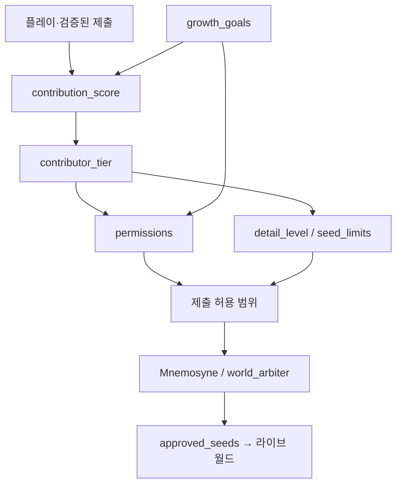

# 14 — 기여도 기반 권한 & 성장·디테일 게이트

## 짧은 답

**가능하다.** 개인이 이세계를 만들 때 **기여도(contribution_score)** 만큼만 권한을 주고, 티어가 오를수록 **쓸 수 있는 콘텐츠 스키마·분기·대사 길이(디테일)** 가 커지게 설계하는 것이 Link OS 월드빌딩의 핵심 루프다.



## 설계 원칙

| 원칙 | 이유 |
|------|------|
| **권한 = 기여의 함수** | 무분별 UGC·메인 스토리 오염 방지 |
| **디테일은 티어 게이트** | 초보는 짧은 소문, 고티어는 분기·다중 NPC |
| **성장 목표는 명시적** | 「다음에 뭘 하면 승급하는지」가 보이는 RPG 루프 |
| **품질은 점수 배율** | arbiter `quality_score` → 추가 점수 (최대 50) |
| **메인 봉인은 별도** | Phase 클라이맥스는 운영 스토리; UGC는 주변·서브 |

## 티어 (5단)

| 티어 | 점수 | 디테일 | 할 수 있는 것 |
|------|------|--------|----------------|
| observer 관찰자 | 0+ | 1 | 소문 투표, 오탈자 플래그, 워크숍 열람 |
| scribe 필경사 | 100+ | 2 | 소문·NPC 한마디 제출 (짧은 템플릿) |
| chronicler 연대기가 | 500+ | 3 | 퀘스트 훅, 자기 제출 수정, 대사 ~6줄 |
| architect 건축가 | 2000+ | 4 | 이벤트 씨앗, 구역 플레이버, 분기 3, 멘토 |
| worldwright 세계필자 | 8000+ | 5 | 분기 씨앗 8, 세력 소문 제안, fast-track |

설정 파일: `config/contributor_tiers.json`  
스키마: `config/contributor_meta.schema.json`  
엔진: `utils/contrib_permissions.py`

## 점수 획득 (예시)

| 활동 | 기본 점수 |
|------|-----------|
| 승인된 소문 | 25 |
| 승인된 대사/ bark | 40 |
| 퀘스트 훅 | 80 |
| 이벤트 씨앗 | 150 |
| 분기 씨앗 | 280 |
| 메인 스토리 phase 완료 | 120 |
| Precision 플레이 1시간 환산 | 2/시간 (향후 훅) |

`award_contribution(flags, entry, approved=True, quality_score=0.9)` 가 점수·티어·목표를 갱신한다.

## 성장 목표 (growth_goals)

게임 내 「세계 공사」 UI에 다음 목표를 노출:

1. **기록 비석** — 워크숍 해금  
2. **첫 승인 소문** — `submit_rumor` 확정  
3. **대사 6줄** — chronicler급 디테일 연습  
4. **분기 사건 1개** — architect 경로  
5. **8000점** — worldwright 승급 연출  

완료 시 `reward_score` + 선택적 `unlock_permission`.

## 디테일성이 늘어나는 방식

제출 시 `validate_submission()` 이 티어별 `seed_limits` 를 검사:

- `max_fields` — JSON 필드 수  
- `max_dialogue_lines` — 대사 줄  
- `max_branches` — 선택지/분기  
- `detail_level` — 요청 등급 ≤ 플레이어 `detail_level`  
- `requires_arbiter` — 고티어만 자동 반영 완화  

**낮은 티어 = 작고 안전한 패치**, **높은 티어 = 시뮬레이션에 가까운 씨앗**.

## flags.world_building (런타임)

```json
{
  "contributor_tier": "observer",
  "contribution_score": 0,
  "detail_level": 1,
  "workshop_unlocked": false,
  "pending_contributions": [],
  "approved_seeds": [],
  "completed_goals": [],
  "permissions_override": [],
  "stats": { "submitted": 0, "approved": 0, "rejected": 0, "endorsements_received": 0 }
}
```

## API 요약

```python
from utils.contrib_permissions import can, award_contribution, next_growth_goal, tier_progress

can(flags, "submit_quest_hook")  # False until tier allows
award_contribution(flags, {"id": "r1", "kind": "rumor", "field_count": 4}, approved=True)
next_growth_goal(flags)  # UI 힌트
tier_progress(flags)     # 다음 티어까지 %
```

## 운영·안전

- **신원 분리:** 기여 프로필 ≠ 현실 계정 (R4)  
- **악용:** 동일 소문 스팸 → reject + 점수 정지  
- **멘토:** architect+ 가 scribe 제출 리뷰 시 양쪽 `peer_endorsement`  
- **메인 스토리:** `main_story.phase` 가 UGC 편집 권한과 무관하게 유지  

## 다음 구현 (T2)

- Link OS 워크숍 UI ↔ `validate_submission`  
- `quest workshop` CLI 명령 (진행도·다음 목표 출력)  
- 승인 씨앗 → `events/seeds/community/` 자동 생성  
- 시즌 리더보드·비석 (opt-in 서명)
