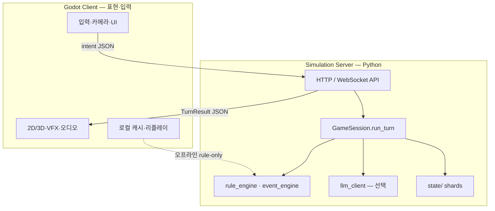

# 15 — Godot 출시 아키텍처

에르도리아를 **Godot 4** 로 출시할 때, 지금의 `fantasy_simulator/` Python 엔진·LLM·150+ 씨앗을 **버리지 않고** 붙이는 설계.

## 핵심 결정: 권위(Simulation Authority)는 서버



| 계층 | Godot | Python (`fantasy_simulator`) |
|------|-------|------------------------------|
| **해야 함** | 렌더, 애니, SFX, UI, 입력, 튜토리얼 | 규칙, RNG, 상태, 이벤트, 메인 스토리, (선택) LLM |
| **하지 말 것** | 마나·데미지·씨앗 트리거 최종 판정 | 3D 메시·셰이더·프레임 동기화 |

**이유:** 이미 160+ 테스트·메인 스토리 엔진·기여도 권한이 Python에 있음. Godot에 규칙을 **복제**하면 이중 유지보수 + 멀티 시 치트·불일치.

---

## Godot 프로젝트 구조 (권장)

```
eldoria-godot/                 # 별도 repo 또는 monorepo /client
  project.godot
  scenes/
    boot.tscn                  # 버전·서버 URL·로케일
    main_menu.tscn
    game/
      world_map.tscn           # 존 선택 (ashpoint, forest, tower)
      exploration.tscn         # 탐험 UI + 이벤트 팝업
      combat.tscn              # 전투 프레젠테이션
      camp.tscn                # 기지 (경영 MVP)
      workshop.tscn            # 2차: UGC (contrib UI)
  scripts/
    net/
      api_client.gd            # HTTP/WebSocket
      session_bridge.gd        # TurnResult → UI 바인딩
    presentation/
      turn_player.gd           # lines[] 순차 표시
      somatic_fx.gd            # [체감] 연출
    data/
      content_cache.gd         # spells/zones 로컬 읽기 전용
  assets/
  addons/                      # 필요 시
```

Python 쪽:

```
fantasy_simulator/
  api/                         # 신규 (T0)
    server.py                  # FastAPI / uvicorn
    schemas/turn_request.json
    schemas/turn_response.json
  ... (기존 엔진 그대로)
```

---

## API 계약 (MVP)

### 요청 `POST /v1/turn`

```json
{
  "session_id": "uuid",
  "action": "explore",
  "temporal_mode": "precision",
  "time_scale": 1.0,
  "mode": "rule"
}
```

### 응답 (기존 `TurnResult.to_dict()` 확장)

```json
{
  "turn": 12,
  "day": 2,
  "time": "afternoon",
  "clock": "[시각 14:35]",
  "minutes_advanced": 5,
  "lines": ["[시각 14:35]", "산책로에서 연기 냄새가…"],
  "world": { "tension": 51, "location": "…" },
  "party": [],
  "combat": null,
  "flags_delta": {},
  "moment_kind": "explore"
}
```

Godot은 **`lines`를 서사 UI**에, `world`/`combat`을 HUD에, `flags_delta`로 퀘스트 마커 갱신.

### 추가 엔드포인트 (출시 전)

| Method | Path | 용도 |
|--------|------|------|
| POST | `/v1/session/new` | 시드·프리셋·난이도 |
| GET | `/v1/session/{id}/status` | status_report |
| POST | `/v1/combat/start` | enemy_id |
| WS | `/v1/stream` | (4단계) Nex presence tick |

**스키마 버전:** `api_version: 1` — Godot `project.godot`와 함께 호환 매트릭스 문서화.

---

## 오프라인 vs 온라인

| 모드 | 설명 | 출시 |
|------|------|------|
| **A. 온라인 rule** | Godot → 로컬/호스팅 Python API | MVP Steam |
| **B. 오프라인 rule** | Godot 내 GDScript **미러** (마나·HP만) | 선택 — 테스트·데모 |
| **C. 하이브리드 LLM** | 서버만 Claude/Codex | 유료 샤드 |

**권장:** MVP는 **A만** — `mode=rule` 고정, LLM은 「프리미엄 월드」 플래그.

오프라인 B는 **장기 부채** — 만들 거면 `export_rules.json`을 Python이 자동 생성하게 하고, **단일 소스** 유지.

---

## Godot ↔ MVP 게임 루프 매핑

| 게임 시스템 | Godot 화면 | 서버 모듈 |
|-------------|------------|-----------|
| 마법 | combat.tscn, 스펠 휠 | `rule_engine`, `rules/magic_system.md` → JSON |
| 탐험 | world_map + exploration | `event_engine`, 존 덱 (향후) |
| 생존 | HUD 게이지 | `flags.survival` (향후 샤드) |
| 경영 | camp.tscn 3버튼 | `flags.camp_*`, `inventory` |
| 유저 세계 | workshop.tscn | `contrib_permissions` |

**수직 슬라이스:** `forest` 1존만 Godot 씬 완성 → API 연동 → 스팀 데모.

---

## 씬·상태 동기화 패턴

1. Godot: 플레이어 입력 → **intent** 문자열만 전송 (`explore`, `cast firebolt`, `talk lilian`)
2. 서버: `GameSession.run_turn()` → 권위 상태 갱신
3. Godot: 응답으로 **전체 상태 스냅샷** 또는 **delta** 적용
4. 애니메이션은 **클라이언트 추측 금지** — `lines`·`combat` 결과 숫자만 신뢰

```gdscript
# session_bridge.gd (개념)
func apply_turn_result(result: Dictionary) -> void:
    hud.set_clock(result.get("clock", ""))
    narrative.play_lines(result["lines"])
    if result.has("combat"):
        combat_scene.sync_from_server(result["combat"])
    world_map.set_tension(result["world"]["tension"])
```

---

## 콘텐츠 파이프라인

| 데이터 | 위치 | Godot |
|--------|------|-------|
| 씨앗·대화 | `events/` | 런타임 fetch 또는 빌드 시 `export/content.pck` |
| 스펠·조합 | `data/spells.json` (신규) | Resource `.tres` 자동 import 스크립트 |
| 로어 | `lore/` | 서버·LLM만 — 클라에 전체 복사 X |
| 밸런스 | `config/` | JSON 그대로 HTTP GET `/v1/content/manifest` |

**빌드:** CI에서 `python tools/export_godot_content.py` → Godot import.

---

## 멀티플레이어 (4단계 — 미리 남길 것)

- 세션 모델: **1 world shard = 1 simulation process**, 파티는 동일 `session_id`
- Godot: 입력만 보냄, **롤백 없음** (턴제/비트제 권위)
- 잠금: `action_lock` per turn — 먼저 도착한 intent만 처리 (또는 리더 고정)

지금 API에 `session_id`·`player_id` 필드만 넣어 두면 이후 확장 쉬움.

---

## 출시 체크리스트 (Steam / 모바일)

| 항목 | Godot | 서버 |
|------|-------|------|
| 저장 | `user://` 설정·그래픽 | 세이브는 서버 `state/` 또는 클라우드 |
| 버전 | `APP_VERSION` | `API_VERSION` 협상 |
| 에러 | 오프라인 배너 | health `/v1/health` |
| 성인/고통 캡 | UI 설정 | `flags.vr_meta` / `bci_meta` |
| 로컬라이제이션 | `.po` / CSV | `lines` 언어는 서버 locale |

**Export preset:** Windows + Linux 먼저 — macOS는 서명 이슈 별도.

---

## 개발 순서 (Godot 관점)

| 단계 | 산출 | 검증 |
|------|------|------|
| G0 | FastAPI `POST /v1/turn` + CLI 동일 결과 | curl == simulation_engine |
| G1 | Godot 빈 씬 + narrative 라벨 + explore 버튼 | 1턴 연동 |
| G2 | combat 씬 + 전투 결과 바인딩 | combat enemy |
| G3 | world_map 3존 + HUD (시계·긴장도) | precision 모드 |
| G4 | camp 씬 + 저장/불러오기 | session new/load |
| G5 | Steam build + 서버 Docker | E2E 30분 |

**기존 로드맵(마법·탐험·생존)** 은 **G1~G3 사이**에서 서버 기능을 채우고, Godot은 **표현만** 따라감.

---

## 안 하는 것 (초기)

- Godot 안에서 메인 스토리 phase 로직 재작성
- Godot procedural generation 엔진 (서버 존 덱 먼저)
- 풀다이브 BCI — PC/Steam 2D·3D RPG 먼저
- 첫 빌드부터 MMORPG 동기화

---

## 관련 문서

- [06_SYSTEMS_MAP.md](06_SYSTEMS_MAP.md) — 엔진 모듈
- [14_CONTRIBUTION_PERMISSIONS.md](14_CONTRIBUTION_PERMISSIONS.md) — workshop 2차
- [../ARCHITECTURE.md](../ARCHITECTURE.md) — TurnResult·state shards
