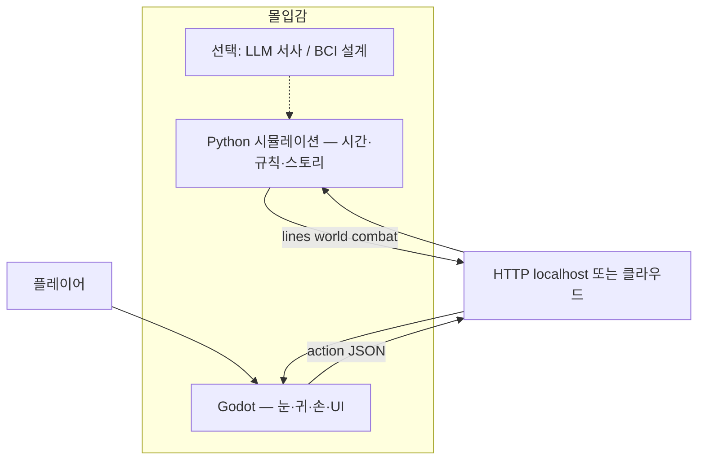

# 16 — 우리 시뮬레이션 엔진 vs Godot 클라이언트 (몰입·비용)

## 한 장 요약

| | 우리 엔진 (Python) | Godot 4.6+ |
|--|-------------------|------------|
| **역할** | 세계·규칙·스토리·RNG·저장 | 화면·입력·사운드·Steam exe |
| **몰입에 기여** | 시간 모델·이벤트·전투·서사·(선택) LLM | 시각·청각·UI·카메라·애니 |
| **라이선스 비용** | 없음 (우리 코드) | **없음** (MIT, 로열티 0) |
| **운영 비용** | 로컬이면 **0원** / 클라우드·LLM은 별도 | **0원** (에디터·Export 무료) |

**Godot API를 쓴다고 해서 몰입이 자동으로 생기지 않고, 돈이 드는 것도 Godot 때문이 아닙니다.**  
몰입 = 우리 엔진(체감·시간·스토리) + Godot(표현) + (선택) LLM·호스팅.

---

## 우리가 만든 “엔진”이란

`fantasy_simulator` = **Simulation Engine** (시뮬레이션 권위)

- `GameSession.run_turn` — 비트/턴·시간 진행
- `event_engine` + 150+ 씨앗 — 탐험·스토리
- `rule_engine` — 마법·전투·마나
- `main_story_engine` — 3단계 메인
- `temporal` — Classic / Nex / **Precision** (분 시계)
- (설계) BCI·Mnemosyne·기여도 월드빌딩

Unity/Godot 같은 **렌더링·물리 엔진이 아님**.  
**“이세계가 어떻게 반응하는가”** 를 담당합니다.

---

## Godot는 무엇을 하나

**Presentation Client** — Steam에 올릴 **그래픽 껍데기**

- 2D/3D, UI, 파티클, BGM/SFX
- 컨트롤러·해상도·Export
- `api_client.gd` → `POST /v1/turn` 으로 **우리 엔진에 질문만 함**

Godot 안에 데미지 공식·씨앗 조건을 넣으면 **우리 엔진을 쓰는 게 아니라** 규칙이 둘로 갈라집니다.



---

## “Godot API 쓰면 무료?” — 비용 정리

### 무료인 것

| 항목 | 설명 |
|------|------|
| **Godot 엔진** | MIT, Steam 상업 출시 로열티 없음 |
| **Godot Editor** | 다운로드·Export 무료 |
| **우리 엔진 + 로컬 API** | 유저 PC에서 `uvicorn` / `eldoria-server.exe` → **월 호스팅 0원** |
| **`POST /v1/turn`** | 우리가 만든 HTTP 계약 — 라이선스 비용 없음 |

### 돈이 들 수 있는 것 (Godot와 무관)

| 항목 | 언제 | 대략 |
|------|------|------|
| **클라우드 VPS** | 24h 온라인 샤드·멀티 | 월 $10~수백+ |
| **LLM API** | Claude/GPT 서사· arbiter | 토큰당·유저 수에 비례 |
| **Steam** | 출시 | $100 (1회) + Steam 수수료 30% |
| **아트·음악·더빙** | 몰입 연출 | 외주/에셋 스토어 |
| **BCI/VR 하드웨어** | 풀다이브 비전 | 별도 (설계만이면 0) |

**정리:**  
- **몰입을 Godot로 올리는 것 자체는 무료** (엔진·로컬 연동).  
- **비용은 “항상 켜 두는 서버”와 “LLM 호출”** 에서 나옵니다.  
- Steam 싱글 MVP = **Godot 무료 + Python 로컬 번들 무료** 가 기본 조합.

---

## 몰입감 — 어디에 투자하나

| 층 | 우리 엔진 (비용 낮음~중) | Godot (아트 비용) | 비용 큼 |
|----|-------------------------|-------------------|---------|
| 시간 체감 | Precision 분 시계, Nex `[체감]` | 시계 UI, 낮/밤 라이팅 | — |
| 세계 반응 | tension, rumors, 씨앗 | NPC 스프라이트, ambient SFX | LLM 실시간 서사 |
| 전투·마법 | 스펠·마나·조합 (데이터) | 이펙트, 히트스톱, 카메라 쉐이크 | — |
| 스토리 | 메인 3단계, 분기 테스트 | 컷신 연출 | 대량 LLM |
| 장기 | 기여도·UGC 씨앗 | workshop UI | 클라우드 샤드 |

**몰입을 “엔진만”으로 올리는 저비용 레버:**

1. `temporal_mode=precision` + `[시각]` + `[체감]` (이미 있음)  
2. 스펠 조합 JSON + 마나 회복 루프 (MVP 마법)  
3. 존 덱 탐험 (procgen 전)  
4. Godot: 타이핑 대사·환경음·간단 카메라 흔들림 (코드 무료, 에셋은 작업량)

**고비용 레버 (나중):** Mnemosyne LLM 매 턴, 클라우드 멀티, 풀 VR.

---

## 추천 아키텍처 (몰입 ↑ 비용 ↓)

```
[Steam 싱글 — 기본판]
  Godot (무료) + eldoria-server.exe 로컬 (무료)
  mode=rule, LLM 끔
  몰입: Precision 시간 + Godot UI/SFX + 손수 씨앗

[프리미엄 / 온라인 — 선택]
  HTTPS API on VPS ($)
  LLM 서사 옵션 ($$)
```

플레이어에게는 **게임 하나**로 보이고, 내부는 **우리 엔진이 권위**입니다.

---

## 자주 헷갈리는 질문

**Q. Godot 쓰면 우리 엔진 안 쓰는 거 아닌가?**  
A. 씁니다. Godot는 `explore` 같은 **의도**만 보내고, **결과는 전부 Python**이 만듭니다.

**Q. API 서버 꼭 켜야 해서 돈 드나?**  
A. **클라우드에 안 올리면 0원.** PC 안 `127.0.0.1` 이면 됩니다.

**Q. 몰입 더 하려면 서버 비용이 필수?**  
A. 아니요. **로컬 rule + Godot 연출**으로 대부분 올릴 수 있습니다. LLM·온라인만 추가 비용.

**Q. Godot 없이 몰입만 엔진으로?**  
A. 가능 — Precision·Nex·텍스트 서사. 다만 **Steam “그래픽 게임”** 은 클라이언트(Godot 등)가 필요.

---

## 관련 문서·코드

| 문서 | 내용 |
|------|------|
| [15_GODOT_RELEASE_ARCHITECTURE.md](15_GODOT_RELEASE_ARCHITECTURE.md) | API·Steam 구조 |
| [11_TEMPORAL_MODEL.md](11_TEMPORAL_MODEL.md) | 몰입용 시간 |
| [STEAM_GODOT.md](../STEAM_GODOT.md) | 출시·로컬 서버 |
| [CURSOR_GODOT.md](../CURSOR_GODOT.md) | Cursor 연동 |

| 코드 | |
|------|--|
| `utils/game_session.py` | 시뮬레이션 권위 |
| `api/server.py` | Godot ↔ 엔진 다리 |
| `client/godot/` | 무료 클라이언트 셸 |
