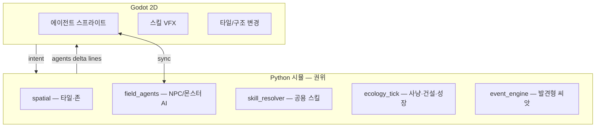

# 20 — 살아 있는 필드: NPC·몬스터·탐험 중심 생태계

## 지향 (당신이 말한 것)

| 기존 (메인 스토리 RPG) | 새 축 (**생태계 모드**) |
|------------------------|-------------------------|
| 씨앗 롤 → 텍스트 이벤트 | **필드에 보이는** 존재가 행동 |
| 퀘스트 로그 중심 | **탐험·발견·개입** 중심 |
| NPC = 대화 노드 | NPC = **스킬·일정·마을 건설** |
| 몬스터 = 전투 입장 | 몬스터 = **사냥·약탈·성장** |
| 2D = 배경 + UI | 2D = **영역·이동·전투·후과**가 맵에 남음 |

**완전 다른 게임 방식**을 원함 → **엔진은 유지**, **플레이 루프를 `ecology` 모드로 분기**하는 게 맞다.  
메인 봉인 3단계를 버리지 않고, **「에르도리아 생태계」** 를 별 모드/별 캠페인으로 키운다.

---

## 2D에서 “정말 새롭게” 일어나는 것

플레이어가 **보고, 늦게 이해하고, 개입**하는 것:

1. **몬스터 무리**가 숲 가장자리에서 NPC 행상을 습격 → 맵에서 **POI가 타봄** / **인구 감소**  
2. **성장한 보스**가 이전보다 큰 스킬 반경 — 같은 타일이어도 **위험도 색**이 다름  
3. **NPC 팩션**이 빈 타일에 `camp` → `hamlet` 으로 격자가 바뀜 (타일 스왑)  
4. 플레이어는 퀘스트 없이 **연기 방향**만 보고 숲으로 들어감 → **거기서만** 전투·구출  
5. **약탈 성장 몬스터**는 잡은 NPC 직업에 따라 **스킬 풀 합성** (대장장이 몬스터 = 화염 보조)

→ **“맵 + 이벤트 텍스트”가 아니라 “살아 있는 격자 + 에이전트”**.

---

## 아키텍처 (기존 시스템 위에 한 층)



| 모듈 | 역할 |
|------|------|
| `spatial` | 어디서 (이미 있음) |
| **`field_agents`** (신규) | 누가, HP, 스킬 CD, 목표 |
| **`ecology_tick`** (신규) | 비트마다/존 tick: 이동·교전·건설·**문명 경쟁** (25) |
| `rule_engine` | 스킬 해석 (전투 확장) |
| `event_engine` | **발견** 시만 짧은 서사 (퀘스트 강제 X) |

---

## 에이전트 모델 (NPC·몬스터 동일 스키마)

```json
{
  "instance_id": "stalker_pack_2",
  "archetype_id": "shadow_predator",
  "kind": "monster",
  "map_id": "forest_01",
  "x": 22,
  "y": 18,
  "hp": 40,
  "goal": "hunt_prey",
  "skills": ["shadow_lash", "ambush"],
  "skill_cooldowns": {"shadow_lash": 0},
  "traits": ["plunder_growth"],
  "plunder": { "npc_victims": 1, "power_bonus": 3 },
  "ai": "predator_patrol"
}
```

```json
{
  "instance_id": "maren_build_team",
  "archetype_id": "village_elder",
  "kind": "npc",
  "map_id": "ashpoint_01",
  "goal": "build_hamlet",
  "skills": ["lay_stone", "rally"],
  "settlement": {
    "site_x": 50,
    "site_y": 20,
    "stage": 1,
    "name": "신작 마을 터"
  },
  "ai": "builder"
}
```

**저장:** `state/field_agents.json` (샤드) 또는 `flags.ecology.agents[]`.

**Godot:** `GET /v1/world/agents?map_id=` → 스프라이트 위치·애니·HP바.

---

## 스킬 (NPC·몬스터·플레이어 공용)

`data/skills.json` + `skill_resolver` (rule_engine 확장):

| 타입 | 예 | 2D 연출 |
|------|-----|---------|
| damage | shadow_lash | 투사체·범위 타일 빨강 |
| buff | rally | NPC 주변 버프 링 |
| build | lay_stone | 타일 → `structure` |
| hunt | ambush | 다음 교전 선제 |

**필드 교전:** 두 에이전트가 **같은 타일/인접** → `ecology` micro-combat (1~3 라운드) → 승자 이동·약탈·사망.

플레이어 개입: 접촉 시 **기존 `combat` 씬** 또는 **필드 RTwP** (짧게).

---

## 몬스터: 약탈·성장 (당신 컨셉)

| 단계 | 규칙 |
|------|------|
| 사냥 | `goal=hunt_prey` — 맵上的 NPC/약한 에이전트 탐색 |
| 약탈 | 승리 시 `plunder`: 골드·아이템·**victim_archetype** 기록 |
| 성장 | `plunder_growth`: victim 수당 `power_bonus`, 스킬 1개 흡수 (데이터) |
| 영역 | 성장 단계↑ → `territory_radius` ↑ (Godot 위험 존) |
| 보스화 | threshold → `archetype` 승급, 스프라이트 교체 |

**윤리/톤:** 판타지 다크 판타지 — `knockout_only` NPC는 납치·구출 가능, 일반 NPC는 사망·인구 감소.

---

## NPC: 마을 만들기 (가능? → **가능, “라이트 시뮬”**)

풀 RimWorld는 아님. **타일·단계·자원**으로:

| stage | 필요 | 맵 효과 |
|-------|------|---------|
| 0 camp | NPC 2명, wood | 텐트 타일 |
| 1 hamlet | stone, 3일 | 우물·집 3칸 |
| 2 village | rep, 방어 | 상점 POI 생성 |

- `goal=build_hamlet` — `lay_stone` 스킬로 **site_x,y** 에 진행도 +1/비트  
- 자원: `flags.ecology.stockpile` (wood, stone) — 플레이어·NPC·이벤트로 유입  
- **완전 자동:** `ecology_tick` 이 비트마다 진행 (플레이어 없어도)  
- 플레이어는 **지원·습격 막기·자원 기부**로 개입

→ **“NPC가 실제로 마을 만든다”** = 데이터+타일+시간으로 **보이게** 하는 것. 3D 건설 애니 없이도 2D 타일 스왑으로 충분.

---

## 탐험 중심 루프 (퀘스트 지양)

```text
걷다가 → 이상 징후 발견 (연기, 비명, 새 tent 타일)
       → 조사 (선택) → ecology 로그 / 짧은 lines
       → 개입 or 관망
       → 세계 상태만 변함 (인구, territory, tension)
       → 다음 탐험 때 “예전 우물이 타버렸다”
```

| 쓰지 않음 | 씀 |
|-----------|-----|
| “퀘스트 3/5” | **발견 저널** (opt-in 메모) |
| 필수 메인 gate | **세계 상태** (봉인은 배경 압력만) |
| 고정 NPC 퀘스트 체인 | **POI + 에이전트** 가 만든 상황 |

메인 스토리 `ashen_seal` 은 **배경 시즌** 또는 **모드 OFF** 일 때만.

---

## Godot 2D (배경만이 아님)

| 레이어 | 내용 |
|--------|------|
| TileMap | 지형 + **structure** (마을 단계) |
| AgentLayer | NPC/몬스터 스프라이트, 이동 lerp |
| FXLayer | 스킬 범위, 피격 |
| FogLayer | 미탐험 / 위험 territory |
| UI | 발견 로그, 개입 프롬프트 |

**동기화 주기:**

- 이동: Godot 보간, **타일 변경 시** position API  
- 에이전트: **3~5초** 또는 **존 진입 시** `GET /v1/world/agents`  
- 교전 결과: 서버가 agents 배열 갱신 → Godot 재배치/제거

---

## 모드 분리 (기존과 “완전 다른 방식”)

`flags.game_mode`:

| 값 | 플레이 |
|----|--------|
| `story` | 지금 메인 3단계 + 씨앗 (기본 테스트) |
| `ecology` | field_agents + ecology_tick, 메인 gate 최소 |
| `hybrid` | 탐험은 ecology, 특정 POI에서만 스토리 beat |

CLI/API: `POST /v1/session/new` `{ "game_mode": "ecology" }`

---

## 구현 로드맵

| 단계 | 산출 | 2D에서 보이는 것 |
|------|------|------------------|
| **E0** | 설계·스키마·`config/field_ecology.json` | — |
| **E1** | `field_agents` 샤드 + spawn 3종 | 숲에 몬스터 2마리 patrol |
| **E2** | `skill_resolver` + 필드 1라운드 교전 | 스킬 이펙트 1개 |
| **E3** | predator + plunder_growth | NPC 줄어듦·몬스터 커짐 |
| **E4** | builder NPC + structure 타일 | 마을 터 성장 |
| **E5** | Godot AgentLayer + territory | **진짜 “살아 있음”** |

**테스트:** `game_mode=ecology` 일 때만 tick — `story` 테스트 168개 유지.

---

## API (예정)

| Method | Path |
|--------|------|
| GET | `/v1/world/agents?map_id=forest_01` |
| POST | `/v1/ecology/tick` (존 단위, 디버그) |
| POST | `/v1/turn` + `game_mode` |

---

## 한 줄

- **NPC/몬스터에 스킬·목표·필드 AI** → 맞고, **구현 가능** (라이트부터).  
- **NPC 마을** → 타일·단계·자원 시뮬로 **보이게** 가능 (풀 건설 게임 아님).  
- **몬스터 약탈 성장** → `plunder` + archetype 승급으로 **데이터 드리븐**.  
- **퀘스트 지양·탐험 중심** → `ecology` 모드 + 발견형 이벤트.  
- **2D 새로움** → **에이전트가 맵을 바꾸는 것**이 핵심 (텍스트만 X).

다음 코딩 착수: **E1** `field_agents.json` + `ecology_tick` 1비트 + Godot 스프라이트 1종.
