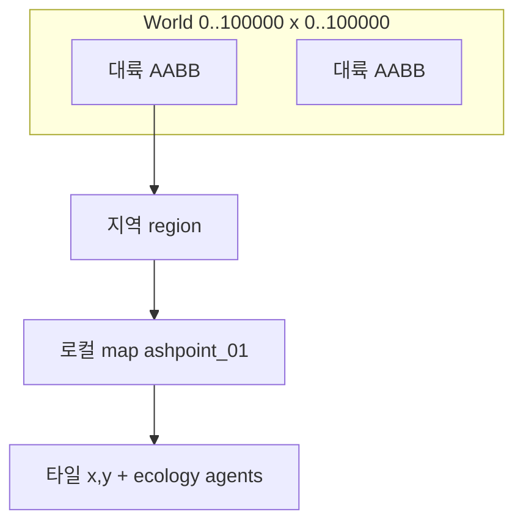

# 23 — 월드 스케일 (10만×10만) · 10대륙 · 첫 왕국

## 한 줄 요약

**에르도리아 전체를 `100_000 × 100_000` 월드 좌표(픽셀/미터 단위)로 잡되, 실제로는 전부를 타일로 깔지 않는다.**  
플레이어는 **첫 왕국(변경·애쉬포인트 주변)** 에서 시작하고, 대륙은 **기능·땅덩어리·세계관** 이 다른 10개로 나뉜다. 지금 플레이 중인 실버우드 변경은 **1번 대륙의 동쪽 가장자리**다.

## 왜 10만×10만을 “한 장의 맵”으로 두면 안 되는가

| 방식 | 타일 수 (16px/타일 가정) | 현실 |
|------|-------------------------|------|
| 단일 Godot TileMap | ~390억 타일 | 메모리·로드·에이전트 한도 폭발 |
| Python 전역 그리드 | 동일 | 턴·생태 시뮬 불가 |
| **계층 좌표 + 청크** | 활성 구역만 수천~수만 타일 | ✅ Steam·로컬 API에 맞음 |

**설계 원칙:** 큰 숫자는 **월드 지도·여행·로어·세력 AI** 용. 걷기·전투·건설은 지금처럼 **`map_id` 로컬 맵**(80×60 타일 등) + `world_x/y` 오프셋.



## 좌표 체계

| 필드 | 범위 | 의미 |
|------|------|------|
| `world_x`, `world_y` | 0 … 99_999 | 대륙 간 절대 위치 (지도·마차·해상 이동) |
| `continent_id` | `silverwood` … | 어느 대륙 AABB 안인지 |
| `region_id` | `frontier_ash` … | 대륙 내 생태·세력·날씨 단위 |
| `map_id` | `ashpoint_01` | Godot 씬 + 시뮬 권위 (기존) |
| `x`, `y` | 맵 로컬 타일 | 기존 `world_maps.json` |

**픽셀 환산 (Godot):** `world_pixel = world_coord * godot_pixel_per_world_unit` (기본 1:1 또는 1 world unit = 16px — `config/world_atlas.json` 참고).

**첫 왕국 시작점 (권장):**  
`continent_id: silverwood` → `region_id: frontier_ash` → `map_id: ashpoint_01`  
플레이어 왕국 타일은 `flags.ecology.player_settlement` / 건설 API로 **같은 region 안** 확장.

## 10대륙 — 기능·크기·세계관

땅덩어리는 **월드 좌표 AABB 면적 비율** (대략). “초라해 보이는” 첫 왕국은 **실버우드 동쪽 2%** 만 플레이 가능해도, 로어상으로는 **봉인 전선의 한 귀퉁이**로 정당화된다.

| # | ID | 이름 | 월드 역할 | 면적 비율 | 땅 형태 | 세계관·시스템 훅 |
|---|-----|------|-----------|-----------|---------|------------------|
| 1 | `silverwood` | 실버우드 | **시작·봉인·메인 스토리** | ~14% | 넓은 동서 숲 + 동쪽 변경 평원 | 애쉬포인트, 관측탑, `ashen_seal`, Phase 1–3 |
| 2 | `aurelia` | 오렐리아 왕국령 | 정치·수도·기사단 | ~11% | 온대 평원·강 | `silver_cross_order`, 실버헤이븐(예정) |
| 3 | `ironhold` | 철요새 연맹 | 제작·요새·PvE 던전 | ~6% | 산악 고원 (조밀) | 대장간 티어, 군수 퀘스트 |
| 4 | `sunscar` | 태양상흔 사막 | 유적·낙타·마법 유물 | ~18% | 초대형·희박 오아시스 | 고대 봉인 파편, `tension` 이벤트 |
| 5 | `frostveil` | 서리장막 군도 | 항해·보스·계절 겨울 | ~9% | 파편 섬마다 | `season` 겨울 고정 구역 |
| 6 | `emerald_coast` | 에메랄드 해안 | 무역·해적·함대 | ~8% | 긴 해안선 | `silverwood_trade_union`, PvP 항구(후속) |
| 7 | `umbral_rift` | 심연 균열지 | 칠흑·파워·고위험 | ~5% | 작지만 깊음 (협곡) | `black_covenant`, `horror_extreme` |
| 8 | `skyreach` | 천공 능선 | 감시자·기록·부유 섬 | ~7% | 수직 스택 맵 | `ashen_wardens`, 기록의 탑군 |
| 9 | `verdant_maw` | 비취 야생 | 몬스터·진화·생태 | ~16% | 초원·늪·밀림 혼합 | `field_ecology`, 진화 체인 다수 |
| 10 | `cradle_sea` | 요람 해 | 대륙 연결·보스·시즌 | ~6% | 바다 (항로만 타일화) | 시즌 이벤트·봉인 조수 |

**합계:** 100% — 중앙 해역이 다른 대륙을 **항로 그래프**로 잇는다 (도보 불가, 배·텔레포트 룬).

### 지금 구현과의 위치

```
[실버우드 대륙]
  서쪽: 고대 숲·봉인선 (미개방)
  중앙: 실버헤이븐 방향 (시즌 2)
  동쪽 변경 Frontier ← ashpoint / forest / tower (현재 map 3장)
```

플레이어 **첫 왕국** = `frontier_ash` 안 건설·고용·왕국 API (`21_PLAYER_SETTLEMENT_BUILDING.md`).  
대륙 단위로 보면 작아 보이지만, **전체 10만² 중 ~2,800² (실버우드 AABB)의 한 코너**라서 “왕국 하나로 시작” 납득 가능.

## 기술 로드맵 (버그 없이 키우기)

| 단계 | 내용 | 엔진 |
|------|------|------|
| W0 | `world_atlas.json` 메타만 | ✅ 스캐폴 |
| W1 | `world_x/y` + `continent_id` on `world` | `spatial.sync_position` |
| W2 | 지역 `region_id` → 날씨·스폰 테이블 | `progression.map_spawn_limits` per region |
| W3 | 월드 맵 UI (저해상도 1024² 텍스처) | Godot |
| W4 | 청크 스트리밍 (활성 맵 ±1) | Godot + API |
| W5 | 대륙 간 여행 (일/마차/배) | `temporal` + 골드 |

**개체 수:** 대륙이 커져도 **활성 `map_id` 하나**에만 `agents_per_zone_max` / `species_caps` 적용 (doc 22).

## Godot 권장

- **월드 미니맵:** 100k² → 1024×1024 텍스처 (1px ≈ 98 world units)
- **플레이 영역:** 실제 씬은 `map_id` 단위만 로드
- **카메라:** 로컬 80×60; 월드맵 모드에서만 축소

## 콘텐츠 우선순위 (제안)

1. 실버우드 — 변경 3맵 + 왕국 건설 (현재)
2. 오렐리아 — 실버헤이븐 허브 1맵 (정치)
3. 비취 야생 — 진화·몬스터 밀도 (탐험 성장)
4. 심연 균열지 — 칠흑 서약 (파워 루트)
5. 나머지 — 시즌별 1대륙씩

## 관련 파일

- `config/world_atlas.json` — 10대륙 AABB·region·연결
- `config/world_maps.json` — 로컬 맵 (기존)
- `docs/design/03_WORLD_ATLAS.md` — 변경·존 (기존, 실버우드 상세)

## 관련 문서

- [03_WORLD_ATLAS.md](03_WORLD_ATLAS.md)
- [19_SPATIAL_SIMULATION.md](19_SPATIAL_SIMULATION.md)
- [21_PLAYER_SETTLEMENT_BUILDING.md](21_PLAYER_SETTLEMENT_BUILDING.md)
- [22_CHARACTER_PROGRESSION.md](22_CHARACTER_PROGRESSION.md)
