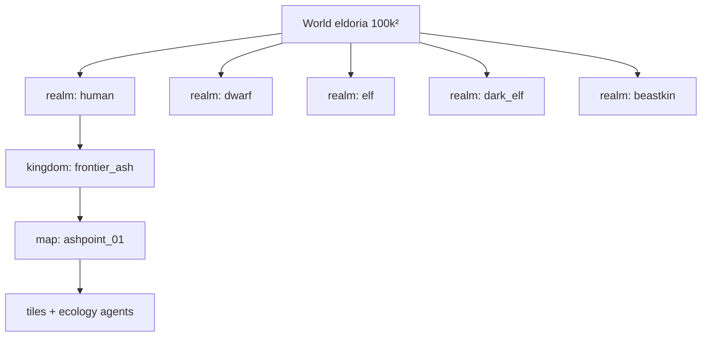

# 23 — 행성 에르도리아 스케일 · 종족 5영역 · 왕국·마을

> **에르도리아** = 시스템·**행성**·게임 전체 이름 (애쉬포인트 ≠ 에르도리아 전체). 정의·MMO 독점 억제: [24_ELDORIA_UNIVERSE_AND_POWER_ECOLOGY.md](24_ELDORIA_UNIVERSE_AND_POWER_ECOLOGY.md).

## 한 줄 요약

**행성 에르도리아** 한 개 (`100_000 × 100_000` 월드 좌표). 그 안에 **인간·드워프·엘프·다크엘프·수인** 영역이 있고, 영역마다 마을·왕국·세력 허브가 다르다.  
지금 플레이하는 **애쉬포인트**는 **인간 영역 → 잿빛 변경 왕국(초기)** 에 해당한다. 실버우드 숲·봉인선은 **엘프 영역과 인간 변경의 접경**.

## 계층 (플레이·엔진)



| 층 | ID 예 | 역할 |
|----|-------|------|
| World | `eldoria` | 절대 좌표·월드맵·시즌 봉인 긴장도 |
| **Realm** | `human`, `elf`, … | 종족 문화·기본 법·스폰 테이블·외교 기본값 |
| **Kingdom** | `frontier_ash`, `iron_clan` | 정치 단위·플레이어 왕국·세력 평판 묶음 |
| **Settlement** | `ashpoint`, `silverhaven` | 마을/도시·NPC 허브 |
| **Map** | `ashpoint_01` | Godot 씬 + 시뮬 권위 (기존) |

**전부를 타일로 깔지 않음** — 활성 `map_id`만 로드, `species_caps`는 맵 단위 (doc 22).

## 5종족 영역 — 특색·지형

| Realm | 한글 | 지형·분위기 | 시스템·세계관 훅 |
|-------|------|-------------|------------------|
| `human` | 인간의 땅 | 평원·변경·강·해안 마을 | 애쉬포인트, 자치회, 십자 기사단, **첫 왕국**·건설 |
| `dwarf` | 드워프의 땅 | 산맥·지하 홀·용광로 | 대장간 티어↑, 요새 던전, `ironhold` 연맹 |
| `elf` | 엘프의 땅 | 고대 숲·은빛 나무·봉인선 | 실버우드, 관측탑, 봉인 메인, `ashen_wardens` |
| `dark_elf` | 다크엘프의 땅 | 지하 균열·야간 도시 | `black_covenant`, 고위험 마법·협상/적대 분기 |
| `beastkin` | 수인의 땅 | 초원·늪·부족 영지 | `field_ecology`·몬스터 진화 밀도, 부족 동맹 |

영역 경계는 **자연 지형 + 외교 상태** (전쟁 시 통행 제한). 종족 ≠ 플레이어 직업 — 이세계 전송자는 어느 영역에서든 시작 가능하나, **스토리 MVP는 인간 변경** 고정.

## 왕국·마을 (로드맵 포함)

### 인간 (`human`)

| Kingdom | 성격 | 대표 거점 | 상태 |
|---------|------|-----------|------|
| `frontier_ash` | 변경·봉인 전선, 생존·자치 | **애쉬포인트**, 북숲, 관측탑 | ✅ 플레이 3맵 |
| `aurelia` | 왕정·기사·상인 수도권 | 실버헤이븐 (예정) | 🔜 |
| `coast_march` | 항구·무역·해적 | 항구 마을 (예정) | 🔜 |

### 드워프 (`dwarf`)

| Kingdom | 성격 | 대표 거점 |
|---------|------|-----------|
| `deepforge_union` | 대장간·광산 연합 | 철심 요새 |
| `stonegate_clans` | 부족·투기장 | 석문 협곡 |

### 엘프 (`elf`)

| Kingdom | 성격 | 대표 거점 |
|---------|------|-----------|
| `silver_court` | 고대 숲·봉인 수호 | 실버 심장림 |
| `moonveil_enclave` | 학파·예언 | 달빛 신전 |

### 다크엘프 (`dark_elf`)

| Kingdom | 성격 | 대표 거점 |
|---------|------|-----------|
| `umbral_houses` | 귀족 암투·서약 | 심연 균열 성채 |
| `night_market` | 금단 거래 | 암시장 터널 |

### 수인 (`beastkin`)

| Kingdom | 성격 | 대표 거점 |
|---------|------|-----------|
| `pride_lands` | 사바나·사냥·의식 | 맹수 영지 |
| `mistfen_pack` | 늪·부족 연합 | 안개 습지 |

## 시작 플레이어 · 첫 왕국

```json
"starter": {
  "world_id": "eldoria",
  "realm_id": "human",
  "kingdom_id": "frontier_ash",
  "settlement_id": "ashpoint",
  "map_id": "ashpoint_01"
}
```

왕국 건설·고용 API는 `kingdom_id` / `settlement_id`와 점진 연동 (doc 21).

## 월드 좌표 (AABB 요약)

`config/world_atlas.json` — 5영역이 **한 판**을 나눔 (겹치지 않는 육지 + 중앙 **중립 바다/교역해**).

- **인간:** 동남 평원·변경 (애쉬포인트 위치)
- **엘프:** 인간 서쪽·북쪽 숲 (실버우드)
- **드워프:** 북서 산맥
- **다크엘프:** 남서 지하 입구
- **수인:** 동북~중동 야생

## Godot · API (변경 예정)

| 필드 | 설명 |
|------|------|
| `world.realm_id` | 종족 영역 |
| `world.kingdom_id` | 왕국 |
| `world.world_x/y` | 월드맵 좌표 |

미니맵: 1024² 텍스처에 5영역 색 구분.

## 콘텐츠 우선순위

1. 인간 `frontier_ash` — 현재 3맵 + 왕국 건설  
2. 엘프 접경 — 봉인·관측탑 확장 (같은 region 인접)  
3. 수인 — 진화·생태 밀도  
4. 드워프 — 제작·던전  
5. 다크엘프 — 칠흑 루트  

## 관련

- `config/world_atlas.json`
- [03_WORLD_ATLAS.md](03_WORLD_ATLAS.md) — 애쉬포인트·존 상세
- [04_FACTIONS_AND_POLITICS.md](04_FACTIONS_AND_POLITICS.md) — 세력은 **왕국·마을에 소속**
