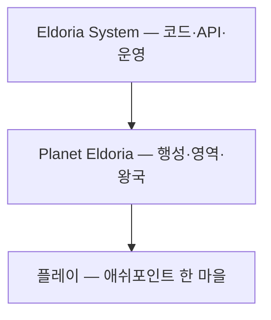

# 24 — 에르도리아 정의 · MMORPG 전력 생태 (독점 억제)

## 「에르도리아」가 무엇인가

**에르도리아(Eldoria)** 는 마을 이름이 아니라, **우리 게임 전체를 가리키는 최상위 이름**이다.

| 층 | 이름 | 의미 | 예 |
|----|------|------|-----|
| **시스템** | Eldoria / `fantasy_simulator` | 시뮬 엔진·API·Godot·Steam·BCI 스택 | `execute_turn`, `/v1/session` |
| **행성 (월드)** | 행성 에르도리아 | 10만² 좌표·5종족 영역·봉인·계절이 도는 **한 개의 행성** | `world_id: eldoria` |
| **서사 (디제틱)** | “에르도리아에 전송되었다” | 플레이어·NPC가 말하는 세계 | 장로의 봉인 설명 |
| **제품 (메타)** | Eldoria Link Nex 등 | 출시·마케팅·로비 | Steam 페이지 |



**애쉬포인트·실버우드·잿빛 변경** = 행성 위 **인간 영역의 한 왕국·마을**.  
**MMORPG**로 갈 때도 샤드는 “행성 에르도리아의 한 조각”이지, 에르도리아가 지명 하나가 아니다.

관련: `config/world_atlas.json` · [23_WORLD_SCALE_AND_TEN_CONTINENTS.md](23_WORLD_SCALE_AND_TEN_CONTINENTS.md)

---

## MMORPG 방향 — 경쟁은 있되, 독점 세계는 만들지 않는다

### 플레이어가 싫어하는 패턴 (금지 목표)

| 패턴 | 증상 | 왜 안 되는가 |
|------|------|----------------|
| **자원 독점** | 한 길드가 모든 광맥·보스·항구 소유 | 신규·솔로·RP 유저 이탈 |
| **전력 독점** | 상위 1%가 맵·PvP·경제 전부 지배 | “강해지면 끝”이 아니라 “강한 애만 게임” |
| **NPC·몬스터 독점** | 한 마리 알파가 영역 전체를 비움 | 필드 생태(20·22) 붕괴 |
| **정보·퀘스트 독점** | 필수 루트가 소수 이름에만 묶임 | 메인 스토리·탐험이 막힘 |

### 허용·권장하는 패턴

| 패턴 | 설명 |
|------|------|
| **소수의 전설** | 보스급 NPC·유저·몬스터 **몇 명/몇 마리**는 매우 강함 — 이야기·위협용 |
| **다수는 중간층** | 대부분 플레이어·NPC·몬스터는 “견줄 만한” 수준, 서로 역할 분담 |
| **지역 분산** | 강자가 **한 샤드·한 맵**에만 영향; 다른 영역은 다른 메타 |
| **시즌 리셋·유산** | 절대 독점은 시즌마다 완화, 칭호·코스메틱만 이전 (07·08) |

---

## 설계 원칙 (7가지)

1. **Apex는 희귀 (apex rarity)**  
   샤드당 “전설” 등급 개체 수 상한 — 플레이어·NPC·몬스터 **합산** 캡.

2. **지배는 구역 한정 (territory cap)**  
   한 왕국·길드·몬스터 무리가 점유할 수 있는 **자원 노드·맵 비율** 상한 (예: 15%).

3. **강자에게 유지비 (dominance tax)**  
   점유가 넓을수록 유지·방어·평판 드리프트 비용 ↑ — 무한 팽창 비용.

4. **대안 루트 항상 존재 (parallel progression)**  
   같은 재료·경험을 **다른 지역·다른 플레이 스타일**로도 얻게 (제작·탐험·교역).

5. **NPC·몬스터도 롱테일 (ecology long tail)**  
   고블린 킹·그림자 우두머리는 **진화 상한 + 맵 species_caps** (doc 22).  
   “맵 전체를 먹는 알파 1마리” 금지.

6. **PvP는 opt-in·비대칭 완화**  
   변경·마을 안전 구역, 실력 차 큰 쪽에 **루트/데미지 완화** (MMO 시 적용).

7. **협력이 경쟁만큼 보상 (co-op parity)**  
   공동 건설·방어·교역 이벤트가 **솔로·소규모**에도 동등한 진행 속도 제공.

---

## 전력 곡선 (목표 분포)

```
강함 ▲
     │     ★ 전설 (극소수)
     │    ▲
     │   ███ 정예
     │  ███████ 일반 대다수
     │ ███████████ 약자·신규
     └──────────────────► 인구/개체 수
```

- **전설:** 샤드당 플레이어 ~0.1%, 필드 보스 ~1–3종, 스토리 NPC ~수십 명 중 1–2명 “불가능에 가까움”.
- **정예:** 공략·PvP 상위권이지만 **한 구역**만 지배 가능.
- **일반:** 대부분 — 퀘스트·건설·탐험·교역으로 충분히 즐김.

---

## 엔진·데이터 훅 (현재·예정)

| 메커니즘 | 상태 | 파일/모듈 |
|----------|------|-----------|
| 맵당 몬스터·종족 상한 | ✅ | `progression.json` `map_spawn_limits` |
| 필드 진화 상한 (킹 티어 캡) | ✅ | `evolution_chains` tier 3 + caps |
| 세력 평판·다극 정치 | ✅ | `factions.json`, phase2/3 |
| 플레이어 왕국 건설 (분산 거점) | ✅ | `settlement_buildings.json` |
| 샤드 전역 apex 카운터 | 🔜 | `config/power_ecology.json` |
| 길드 영토 % · dominance tax | 🔜 | MMO 레이어 |
| 안전 구역·PvP 플래그 | 🔜 | `world_maps.json` zones |

### `config/power_ecology.json` (스캐폴)

MMO 전환 시 서버 규칙으로 로드. 싱글·ecology 모드에서는 **스폰 캡만** 선적용.

---

## 싱글·ecology 지금 당장 하는 일

독점이 생기기 **전**에 습관을 만든다.

- 맵에 고블린·그림자 야수 **종족 상한** — 한 마리가 맵을 비우지 못함.
- 플레이어 왕국은 **한 region에 여러 작은 거점** 확장 (한 타일 제국 X).
- 세력은 **6+α 다극** — 한 세력 완승 엔딩만이 아님 (04).

---

## 톤 한 줄

> **에르도리아는 치열하지만, 한 명·한 길드·한 마리가 세계를 삼키지는 않는 행성이다.  
> 전설은 존재하고, 대부분은 그 전설 옆에서 자기 땅을 가꾼다.**

## 관련 문서

- [00_VISION.md](00_VISION.md)
- [01_FULLDIVE_PLATFORM.md](01_FULLDIVE_PLATFORM.md)
- [04_FACTIONS_AND_POLITICS.md](04_FACTIONS_AND_POLITICS.md)
- [20_LIVING_FIELD_ECOLOGY.md](20_LIVING_FIELD_ECOLOGY.md)
- [22_CHARACTER_PROGRESSION.md](22_CHARACTER_PROGRESSION.md)
