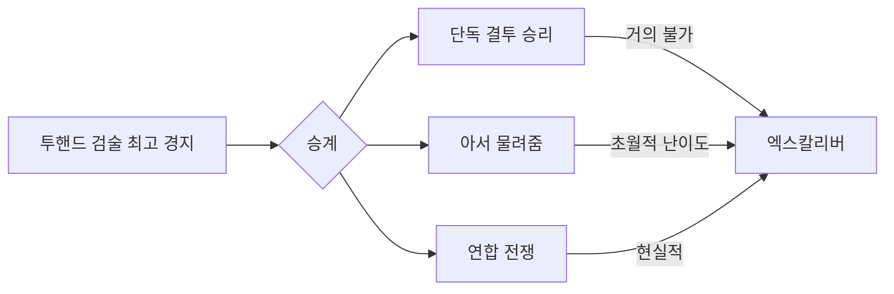

# 34 — 준신 주권자 · 엑스칼리버 · 4년 주권 소원

## 위치 (티어)

```text
T1~T3 일반 → 전설 L1~L6 → 신화 M1~M3 (active ~30)
  → 준신(Demigod) · 【엑스칼리버】= 아서 홀더의 권능 무기
```

- **준신 세트**는 5종족 신화 T3 15개 + 월드 보스 극한 재료 + 세계 유일 대장장이로 **재련 가능** (극희귀).
- **초기 세계**: NPC **아서왕**이 이미 엑스칼리버(준신 성검)를 착용·`world_sovereign` 홀더.
- **양손검(투핸드 소드)** 이기 때문에 **마법사·한손검·활** 주력은 불가 — **투핸드 검술 최고 경지** 검사만 착용·승계 자격.
- 승계: **① 아서와 결투 승리** ② **아서가 물려줌** (극히 어려움) ③ **연합 전쟁**으로 뺏기 (사실상 현실적 루트).

관련: [24_ELDORIA_UNIVERSE_AND_POWER_ECOLOGY.md](24_ELDORIA_UNIVERSE_AND_POWER_ECOLOGY.md) · [36_ITEM_GRADES_AND_LEVEL_SUPREMACY.md](36_ITEM_GRADES_AND_LEVEL_SUPREMACY.md) · [37_ARTHUR_AND_MONSTER_GRAND_COALITION.md](37_ARTHUR_AND_MONSTER_GRAND_COALITION.md)

---

## 엑스칼리버 권능 — 「4년에 한 번, 세계에 소원」

| 항목 | 규칙 |
|------|------|
| **이름** | `sovereign_wish` (주권 소원) |
| **주기** | **게임 내 4년**마다 1회 (`days_per_year` × 4 경과) |
| **행위자** | `world_sovereign.holder` (초기: `npc_arthur_pendragon`) |
| **효과** | 홀더가 세계에 **소원을 전달** → 시뮬이 **반드시 이행** (단, 아래 한도 내) |
| **UI** | 고담 의식 + 구조화 `edict_payload` (자연어는 파서가 edict로 변환) |

### 시간

- `world.day` + `config/demigod_sovereign.json` 의 `days_per_year` (기본 360) → `world_year = day // days_per_year`
- `last_sovereign_wish_year` 와 비교, **4년 미만**이면 거부.
- 소원 발동 시 **전역 이벤트** (하늘·종소리·모든 왕국 소문) — 마법·준신으로 세계가 듣는 **관측 가능 현상**.

---

## 소원이 “이뤄진다”는 것 (시뮬)

소원은 **무제한 치트가 아니라** `edict` 한 장으로 세계 샤드를 바꾼다.

### 허용 범주 (예)

| edict_type | 효과 |
|------------|------|
| `empower_self` | 홀더·파티·몬스터 홀더 스탯·스킬 상한 |
| `empower_kingdom` | 지정 왕국 건설·병력·자원 |
| `weaken_realm` | 특정 종족 영역 spawn·번영↓ |
| `empower_monsters` | 권역/전역 몬스터 진화·습격↑ |
| `found_civilization` | 새 문명·규칙 플래그 (`civilization_coupling`) |
| `reshape_rule` | `flags.world_rules` 커스텀 (기존 룰 덮어쓰기) |

### 이행 파이프라인

1. 홀더가 소원 제출 (`POST /v1/sovereign/wish` 또는 턴 의식)
2. `resolve_sovereign_wish(state, payload)` — **성공 이행** 플래그·로그·`world_conflicts` 후폭풍
3. `last_sovereign_wish_world_day` 갱신
4. **반작용** 자동: 다른 종족 연합·봉인 가속·신화 각성 힌트 (독점 완화)

### 금지·완화 (전설이 쉽지 않듯 준신도)

#### 신(God) vs 준신(Demigod)

| 권한 | 신 — 이세계를 **만든** 존재 | 준신 — 엑스칼리버 홀더 |
|------|---------------------------|------------------------|
| 정체 | 운영·시즌·패치·월드 생성 ([02](02_ISEKAI_FRAME.md)) | 세계 **안**의 반신 왕 |
| 서사 | 봉인 창조자·은빛 관리자 | 아서·승계자·몬스터 홀더 |
| 할 수 있는 것 | 샤드 열기, 시즌 리셋, 규칙 패치 | 4년 소원으로 **국소** 변화 |
| 플레이어 소원 | **불가** (신 영역) | edict 표 안에서만 |

**준신 소원으로 절대 불가 (하드 락)**

| 금지 | 이유 |
|------|------|
| **종족 전체 소멸** | `extinct_race` / `wipe_realm` — `weaken_realm`(약화·패널티)만 상한 있게 |
| **전설·신화 대량 증식** | active ~30·canon ~200 **상한 고정** — 비약적 드랍·제작 소원 거부 |
| **영원한 불사** | `true_immortality` — 수명 연장·부활은 별도 캡·쿨, **죽음 제거** 불가 |
| **신급 행위** | 새 종족 창조·월드맵 재작성·엔진 패치·신으로 승천·즉시 승리 |

시뮬: `resolve_sovereign_wish()` 가 `config/demigod_sovereign.json` 의 `forbidden_edicts` 를 **먼저** 검사 → 거부 시 서사 “신의 봉인이 소원을 막았다” (디제틱: **창조 신**이 준신에게 그 선을 그음).

- **부분 이행**: 허용 범주라도 과도하면 `fulfillment_ratio` &lt; 1 + “세계가 저항했다”
- 홀더가 **검을 잃으면** 미사용 소원 차례는 **검 보유자**만 사용

---

## 엑스칼리버 착용 자격 (투핸드 소드 · 최고 경지)

**들고 있다 ≠ 착용(결속) 가능.** 무기 클래스별 레벨·경지가 따로 있다 — [35_WEAPON_CLASS_MASTERY.md](35_WEAPON_CLASS_MASTERY.md).

| 조건 | 규칙 |
|------|------|
| **무기 종류** | `two_handed_sword` (투핸드 소드 클래스) |
| **필수** | `weapon_masteries.two_handed_sword.level` = **999** + `rank` = **`grandmaster`** |
| **불가** | 인벤 소지·임시 장착·한손 들기만 — **결속(bind) 실패** |
| **금지 클래스** | `staff` · `bow` · `one_handed_sword` 만렉 — 마법사·활·한손검 주력 |
| **주직업** | `job_id`/`job_level` 과 **별도** (기사 Lv5여도 투핸드 Lv3면 불가) |
| **몬스터** | `two_handed_wielder` + 해당 클래스 grandmaster 등가 |

자격 없이 줍기 → **운반만 가능**, 소원·준신 권한 **없음**.  
결속 시도 실패 → “검이 당신의 경지를 인정하지 않는다.”

---

## 아서왕 · 승계 (3길)



| 경로 | 난이도 | 설명 |
|------|--------|------|
| **`duel_arthur`** | ★★★★★ (솔로 거의 불가) | 정면 결투 승리 시 즉시 홀더. 아서는 준신 스탯·배율 극高. |
| **`coalition_war`** | ★★★★ (사실상 정공) | 여러 왕국·종족·플레이어 **연합** — 전쟁·공성·약탈 후 검 탈취. 솔로보다 **현실적**. |
| **`arthur_voluntary_bequest`** | **초월** (매우매우매우 어려움) | 아서가 **스스로** 넘김. 5영역 전설적 업적·타락 거부·신뢰 MAX 등 **전부** 충족. |

### 물려받기 (`bequest`) — 의도적 난이도

한 가지만이 아니라 **동시에** 깨야 하는 숨 시즌급 조건 예:

- **투핸드 소드** 마스터리 `grandmaster` + 주직업 만렙
- 5종족 영역에서 **인정받은 전설적 행적** (각 1회 이상)
- 준신 타락(독단 소원 남용) **거부** 이력
- `arthur_trust` 최대 + 특정 서사 분기 완료
- (선택) 신화 T1 이상 **증표**를 **증여**가 아니라 **시험**으로 건넴

→ 대부분 플레이어는 **연합 전쟁** 또는 **극후반 bequest** 루트를 **몇 시즌** 걸쳐 본다.

### 결투 vs 연합

- **결투**: 엔드게임 빌드·파티 없이 1:1 — **이론상 가능, 사실상 거의 불가**.
- **연합**: `world_conflicts` · 다수 세력 동맹 · 아서 수호군 격파 → **검 contested** → 자격 있는 **검사**가 집어야 소원 권한 (마법사는 집어도 **인정 안 됨**).

---

## 아서왕 · 상태 예시

```json
{
  "world_sovereign": {
    "holder_id": "npc_arthur_pendragon",
    "holder_kind": "npc",
    "title": "반신 왕",
    "since_world_day": 1
  },
  "demigod_regalia": {
    "weapon": {
      "artifact_id": "excalibur_sovereign_blade",
      "tier": "demigod",
      "power_id": "sovereign_wish_every_4_years"
    }
  },
  "sovereign_wish": {
    "interval_years": 4,
    "last_wish_world_day": null,
    "next_eligible_world_day": 1441
  }
}
```

| 이벤트 | 결과 |
|--------|------|
| 자격 있는 검사가 승계 | `holder_id` 교체 + 소원 권한 |
| 마법사가 검 탈취 | **착용·소원 불가** — 연합 루트여도 **검사에게 넘겨야** 완결 |
| 연합 전쟁 승리 | `excalibur: contested` → 자격자 결투·의식으로 확정 |
| 4년 주기 | 이전 홀더 소원 흔적 **영구** (되돌리기 어려움) |

---

## 다른 준신 장비와의 관계

- **엑스칼리버** = 유일 무기 슬롯 권능: **주기적 세계 소원**.
- 준신 방어구·악세서리(재련 세트)는 **별도 패시브** (예: 종족 저항, 에딕트 쿨 감소) — 추후 `config/demigod_regalia.json`.
- **15신화 T3 합성**으로 만든 **새 준신 세트**는 아서 **이전** 시대의 엑스칼리버와 **공존 불가** 또는 **승계 시 하나만 active** (설정 선택).

---

## API · Godot (후속)

| Method | Path | 용도 |
|--------|------|------|
| GET | `/v1/sovereign/status` | 홀더, 다음 소원 가능일, 엑스칼리버 소지 |
| POST | `/v1/sovereign/wish` | edict 제출 (4년 주기 검사) |
| GET | `/v1/world/rumors` | 소원 이행 후 전역 소문 |

Godot: 4년 주기 임박 시 하늘 이펙트·대사 “왕이 세계에 말을 걸 준비가 되었다.”

---

## 한 줄

**엑스칼리버 = 투핸드 소드 · 투핸드 검술 최고 경지만 · 마법사·한손검 불가 · 결투/물려줌/연합 승계 · 4년 소원(신 영역 제외).**
