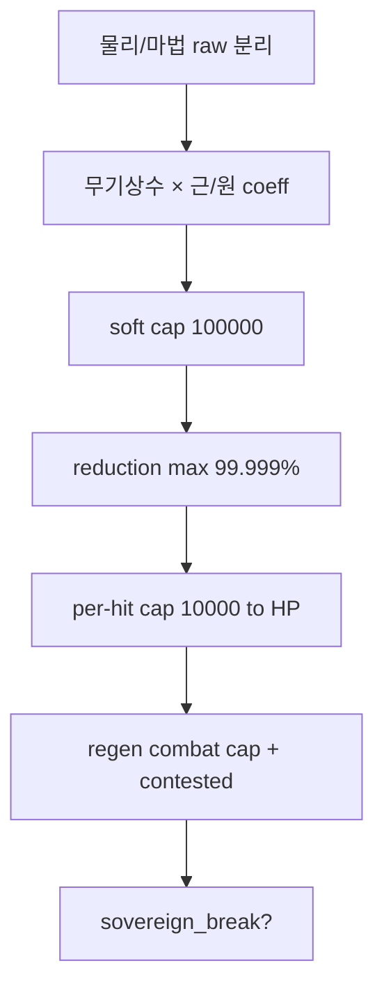

# 40 — 스탯 정밀 설계 · 99.999% 방어 · 아서 생존 구조

## 스탯 축 (0.001)

| 스탯 | 필드 | 비고 |
|------|------|------|
| **물리 공격력** | `phys_attack_milli` | STR·DEX·**무기 물리 상수** |
| **마법 공격력** | `mag_attack_milli` | INT·**무기 술 상수** |
| **물리 방어** | `phys_defense_milli` | 방어구·VIT |
| **마법 방어** | `mag_defense_milli` | 저항·INT |
| **HP** | `hp_milli` | 준신 풀빌드 예 **9999.000** |
| **회복** | `regen_hp_per_sec_milli` | **전투 / 비전투 분리** |

설정: `config/combat_stats.json` · `config/combat_precision.json`

---

## 물리 / 마법 · 근거리 / 원거리

```text
물리 raw = phys_attack × weapon.phys_constant × range_coeff(melee|ranged) × …
마법 raw = mag_attack × weapon.mag_constant × staff_channel × …
```

| | 근거리 coeff | 원거리 coeff |
|--|--------------|--------------|
| 물리 (대검·한손) | 1.000 | 0.820 (활 등) |
| 마법 (지팡이) | — | 1.000~1.150 |

**무기 상수**는 클래스마다 `weapon_constants` 에 **별도** (엑스칼리버 `phys 2.450` 등).

---

## 방어 — 최대 **99.999%** 감쇠

```text
reduction_rate = min(99.999%, f(defense))     // rate_scale 99999 / 100000
damage_after   = raw × (1 - reduction_rate)  // 최소 0.001% 는 통과
hp_loss        = min(MAX_PER_HIT, damage_after)
```

| raw (산출) | 감쇠 | HP 실피해 |
|------------|------|-----------|
| 100000.000 | 99.999% | **1.000** |
| 1000.000 | 99% (일반 빌드) | **10.000** (상한 적용 전) |
| 세계 1위가 받은 예 | — | **1000.000** (로어 앵커) |

- **100% 면역 불가** — 준신도 **0.001%** 는 통과 (진정한 무적 X).
- **한 타 HP 상한** `10_000.000` — 아무리 쌔도 **만 데미지**까지만 HP에 반영.

---

## raw 상한 — 스탯 올인해도 10만 넘기기 어렵게

```text
raw_damage ≤ 100_000.000  (soft_cap_milli)
```

만렙 999·준신 템이어도 **산출 raw** 가 여기서 막힘 → 이후 99.999% 방어·만타 상한이 **이중 안전장치**.

---

## 아서 HP 9999 · 회복 초당 1000 — “절대 안 죽는” 문제

### 문제

- HP `9999` · 회복 `1000/s` → 단일 타 `1000` 피해는 **1초면 회복**.
- 만타 상한 `10000`이어도 회복이 크면 **끝나지 않는 전투**.

### 해결 — **HP만 보지 않는다** (복합)

| 레이어 | 규칙 |
|--------|------|
| **1. 전투 회복 상한** | 전투 중 전역 **200 HP/s** cap (999 Lv도 동일 구간 적용) |
| **2. 주권 쟁탈 `contested`** | 연합 전쟁·검주 보스전 → 회복 **×0.05** (1000/s → **50/s**) |
| **3. 상처 스택** | 연합 공격이 `wound` 부여 — 스택당 회복 **−20%** (최대 10) |
| **4. 만타 상한** | 한 번에 HP **≤10000** — 여러 **동시 타격**(병렬 비트·연합)으로 회복 전에 누적 |
| **5. 쇠약 게이지** | 아서 **HP가 아니라 `sovereign_break`** — 연합 규모가 채우면 패배/검 contested (승계 루트) |
| **6. 4년 소원** | 버티기용이지만 **신급 불사·영원 회복 금지** ([34](34_DEMIGOD_SOVEREIGN_EXCALIBUR.md)) |

```text
연합 전쟁 = contested + wound + 동시 타격 N + break_meter
→ 회복 50/s 인데 초당 피해 합 200+ 이면 아서도 줄어듦
→ break 만땅 시 엑스칼리버 contested → 검사 grandmaster 가 승계
```

**비전투**에서 1000/s 회복은 OK — **전쟁 틱**에서만 쟁탈 규칙.

---

## 만렙 999와 맞추는 법

| 항목 | 999 만렉 시 |
|------|-------------|
| 스탯 성장 | **체감 수익 체감** (diminishing) — 레벨 900→999 차이는 1→100 만큼 크지 않음 |
| 회복 | **전투 cap** 으로 Lv 무관 |
| 데미지 | **raw 10만 cap** + **만타 cap** |
| 준신 | HP 9999는 **표시적 극치** — 승부는 **break·승계·연합** |

---

## 파이프라인 (최종)



---

## 한 줄

**스탯은 0.001·물마분리·무기상수·근원계수 · 방어 99.999%·만타 1만 · raw 10만 상한 · 아서는 전투회복·쟁탈·break로 HP+1000/s 무적 방지.**
