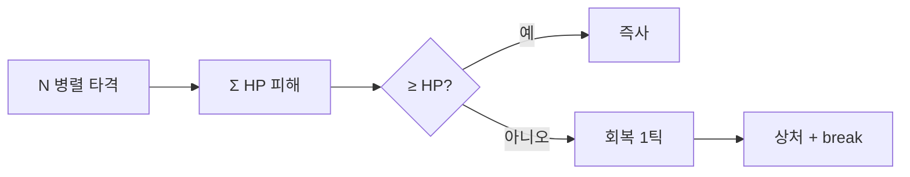

# 41 — 아서 공성 수학 · 연합 병렬 타격

설정: `config/arthur_siege_math.json` · `config/arthur_coalition.json`  
코드: `utils/sovereign_siege.py` · `utils/parallel_beat.py` (주권 홀더 무제한 동시 타격)

---

## 방어 관통 — apex vs 연합

| 공격자 | raw / 타 | HP 실피해 | 아서 잡기 |
|--------|----------|-----------|-----------|
| **세계 정점 ~10명** | 100,000 | **1** | **9,999타** (솔로 사실상 불가) |
| **연합 잡병** | 5,000 | ~0.05 | 수만 명 병렬 |
| **정예 1,000급** | (후방산출) | **1,000** | 2,000명 **동시** = 즉사 |

```text
99.999% 감쇠 + sovereign floor → raw 10만당 HP 1
HP 풀 9,999 → 최소 피해로만 때리면 9,999번
```

---

## 회복 vs 순피해

| 상태 | 회복/s |
|------|--------|
| 전투 상한 | 200 |
| **피격(상처 1스택)** | ×0.8 → **160** |
| 주권 쟁탈 `contested` | 추가 ×0.05 |

**순 +1 HP/s** 를 내려면 연합이 초당 **~160만 raw DPS** 를 동시에 넣어야 회복을 겨우 넘긴다 (스웜 관통률 앵커).

---

## 병렬 비트 규칙

1. **같은 비트** 안의 모든 타격 HP 피해를 **먼저 합산**
2. 그다음 **1초 회복 1틱** 적용
3. 합산 피해 ≥ 현재 HP → **즉사** (회복 없음)
4. `sovereign_break` — 타격 수·연합 규모로 별도 게이지 (HP 외 승리 조건)



---

## 예시 시나리오

| 시나리오 | 결과 |
|----------|------|
| 만 명이 동시에 HP 1씩 | **즉사** |
| 정예 2,000 × HP 1,000 | **즉사** |
| 정점 10명이 각 1/s | 순피해 ≈ 0 (회복 160/s >> 10/s) |
| 연합 수만 + contested | `sovereign_break` 축으로 검 contested·승계 루트 |

---

## 한 줄

**아서는 한 방에 안 죽지만, 연합이 한 비트에 모이면 죽는다 — 정점은 10명뿐, 나머지는 수만 병렬과 break로 잡는다.**
